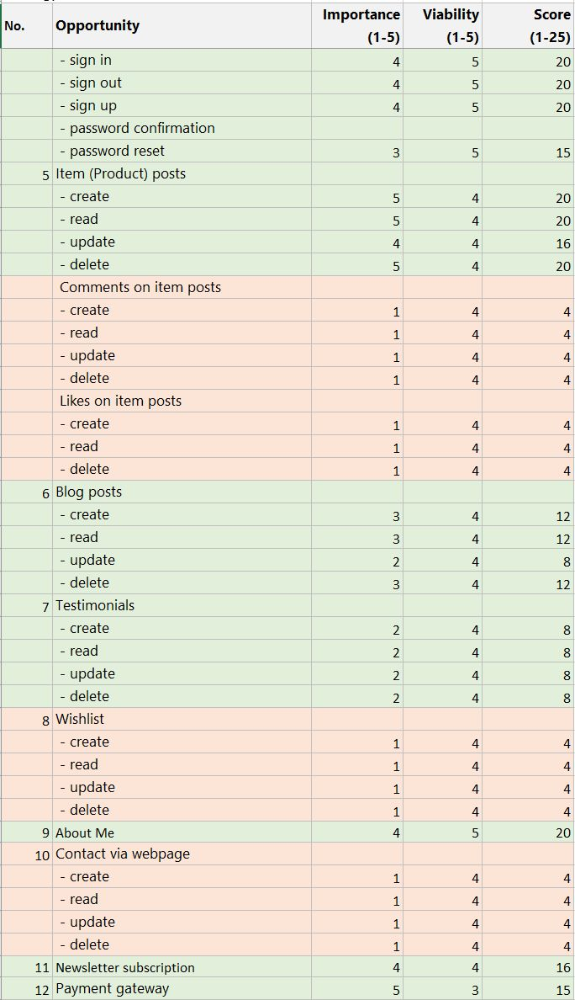
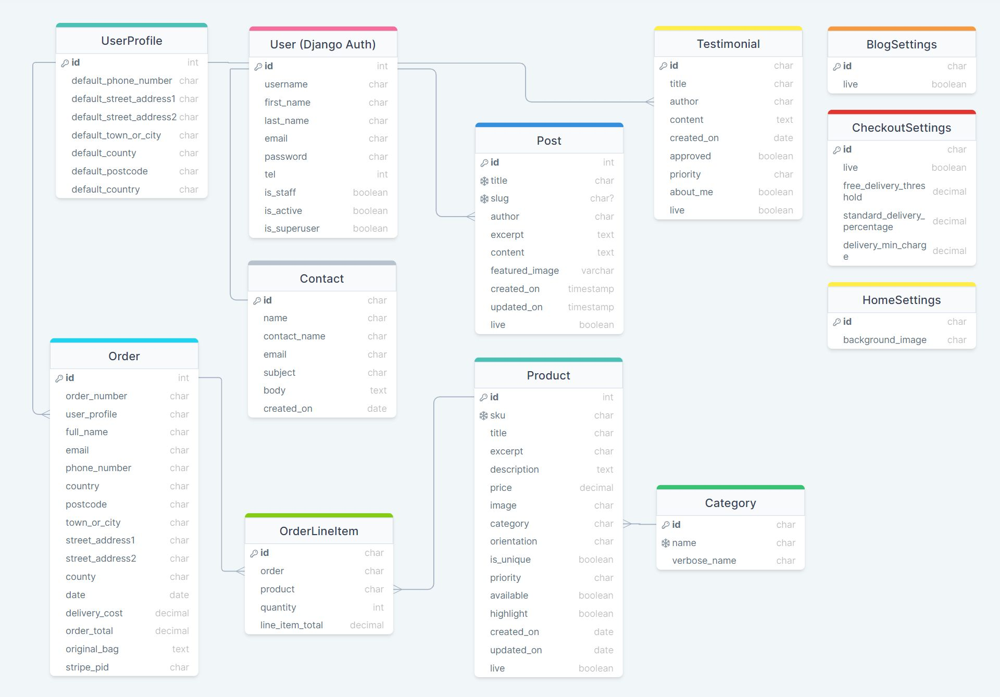
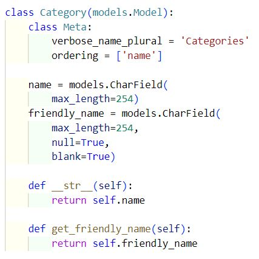
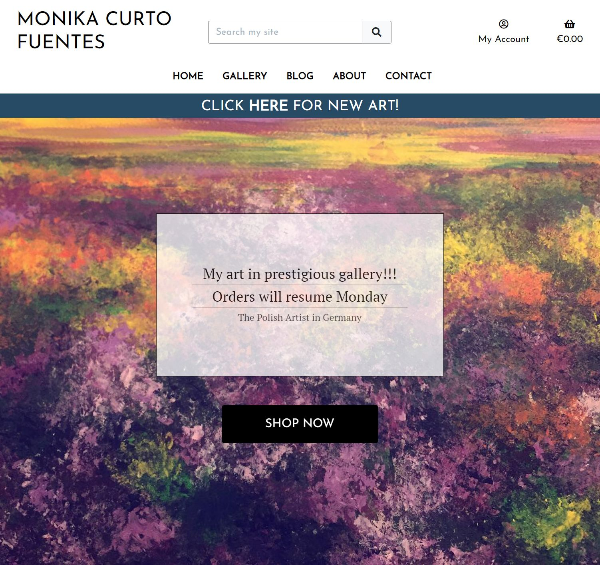
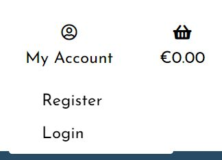
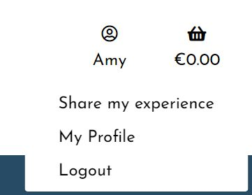

# PolishGirlPainting


View the live site [here](https://polish-girl-painting.herokuapp.com/).

Users for testing:

| Username     | Password | Status   |
| ------------ | -------- | -------- |
| ... | 1qazcde3 | staff    |
| ... | 1qazcde3 | customer |

<br>

# Table of Contents <a name='home'></a>

1. [User Experience (UX)](#ux)<br>
    i.  [User Stories](#user-stories)<br>
    ii. [Scope](#scope)<br>
    iii. [Structure](#Structure)<br>
    iv. [Skeleton and technical design](#skeleton)<br>
    v. [Surface](#surface)<br>
      
2. [Features](#features)<br>
    i. [Current Features](#features-current)<br>
    ii. [Potential features](#features-next)<br>

3. [Marketing Strategy](#marketing-strategy)<br>

4. [Testing](#testing)<br>
    i. [User Story / feature testing](#user-story-testing)<br>
    ii.  [Automated testing](#automated-testing)<br>
    iii.  [Known issues during development and testing](#known-issues)<br>
    iv. [Validation testing](#validation-testing)<br>
    v. [JavaScript testing](#js-testing)<br>


5. [Deployment](#deployment)<br>

6. [Technologies Used](#technology-used)<br>
    i. [Agile Methodology](#agile-methodology)<br>
    ii. [Languages](#languages)<br>
    iii. [Frameworks and Libraries](#frameworks-and-libraries)<br>

7. [Credits](#credits)<br>

8. [Acknowledgements](#acknowledgements)<br>


## Introduction
**The project concept**

PolishGirlPainting is the webpage for an artist showcasing her work on the web and selling her paintings online. 
Apart from allowing the Owner present her pictures for sale, the webpage also helps in developing her clientbase by building a community of people interested in her art.

___

# 1. User Experience (UX) <a name='ux'></a> 
### **Project goals**
The main goal of the project is to provide a platform for selling Artist's paintings and supporting this goal by engaging prospective and current clients interested in acquiring the paintings. This should be achieved through several sub-goals:
-	To enable owner (Artist) to post, edit, read and delete textual and graphical content directly related to her offering.
-	To enable the owner to post in her personal blog.
-	To provide functionality for commercial transactions related to the items for sale.
-	To enable users to view pictures and details on specific art pieces.
-	To enable all users to view the Artist's blog.
-   To enable registered users to share their testimony about their interactions with the Artist.
-	To enable all visitors to subscribe to email newsletter.
-	To enable all users to contact the Artist using details in Contact section.


### **Site owner goals**
-	To ensure the offering is broadcast in a consumer-friendly and appealing way.
-	To have commercial transactions processed in accurate and time-efficient manner.
-	To increase prospective and current customers' interest in the offering.
-	To maximise customers' retainment.
-	To promote knowledge on benefits of art appreciation.
-	To receive requests for custom art creation.
-	To enable customer - Artist correspondence.
-	To build customer database.
-	To assure access to the website on different kinds of devices.


### **User goals**
All users
-	To be able to use service intuitively and with ease.
-	To be able to view content without sharing any details.
-	To view the Artist's collection and find details on each item.
-	To be able to enter contact details and carry out a complete purchase transaction.
-	To be able to contact the Artist.
-   To share their experience in a Testimony.
-	To open and then access account for easier future transactions.
-	To have an aesthetically pleasing and functionally easy experience while using the webpage.


Registered users
-	To log in and log out as needed.
-	To log in with a chosen user name to maintain privacy.
-	To have my details remembered for smooth future transactions.

---

## 1.i. User Stories <a name='user-stories'></a>

### **1. Epic: Account management**

1.1 As a **site user** I can **access site without logging in** so that I can **view content of the webpage**.

1.2 As a **site user** I can **register** so that **I can reuse once entered information**.

1.3 As a **site user** I can **log in using my username and password** so that I can **reuse once entered personal information**.

1.4 As a **site user** I can **log out of my account** so that I know **my information stays confidential**.

1.5 As a **site user** I can **easily see my current login status** so that **I can control my status for privacy protection**.

1.6 As a **site user** I receive **confirmation of logging in and logging out visible on webpage** so that I **instantly know if the operation was successful**.

1.7 As a **site user** I can **reset my password** so that I can **safely remain the website's registered user**.

1.8 As a **site user** I can **read webpage's privacy policy** so that I can **know if my personal information is safe**.


### **2. Epic: Navigation**

2.1 As a **site user** I can **navigate the service intuitively** so that I can **utilize all of its content**.

2.2 As a **site user** I can easily **browse through available items** so I can **decide which ones are most appropriate to me**.

2.3 As a **site user** I can **navigate the site on all kinds of screens** so that **I am not limited to any kind of device**.

2.4 As a **site user** I can **find links to Artist's social media wherever I am on the webpage** so that **I can use alternative means of getting the content**.

2.5 As a **site user** I can **easily go back to home page** so I can **restart my experience**.


### **3. Epic: Customer engagement**

3.1 As a **site user** I can **locate company's social media accounts** so I can **stay in contact through alternative means**.

3.2 As a **site user** I can **subscribe to a newsletter** so I can **stay engaged and stay up do date with the Artist's offering and creative process**.

3.3 As a **registered site user** I can **use website without having to re-enter my details** so that **my activity on the site requires minimum afford from my side**.

3.4 As a **site user** I can **see immediately information about newest content** so I can **go directly to that content should I wish to do so**.

3.5 As a **site user** I can **change the language of the site by an automatic translator** so that I can **read the content in a different language**.

3.6 As a **site user** I can **share my experiences in Testimony** so that **I feel that I contribute to the community gathered around the Artist**.


### **4. Epic: Offer**

4.1 As a **site user** I can **quickly get a general idea about items on offer** so that I can **decide which content to get acquainted with more thoroughly**.

4.2 As a **site user** I can **read details about a chosen item** so that I can **make the best decision about the purchase based on technical information (e.g. size) and my personal preferences**.

4.3 As a **site owner** I can **create, update and delete item entries** so that I can **inform visitors on pieces on offer and pieces sold**.

4.4 As a **site owner** I can **prioritize which items are shown first on the site** so that I can **influence demand on offering of my choice**.


### **5. Epic: Blog**

5.1 As a **site user** I can **read Artist's blog** so that I can **stay up to date with the Artist's developments**.

5.2 As a **site owner** I can **create, update and delete blog entries** so that I can **share content of my choice and build a sense of connection with my audience and prospective buyers**.

5.3 As a **site owner** I can **hide and unhide blog** so that I can **control visibility of the entire blog section of the site at any time**.


### **6. Epic: Checkout**

7.1 As a **site user** I can **smoothly go through purchase process** so that I can **acquire a chosen item**.

7.2 As a **site owner** I can **monitor transaction's status** so I can **ensure process of purchase and delivery is successfully completed**.

### **7. Epic: Admin site**

8.1 As a **site admin** I can **create, update and delete user profiles in admin page** so that **all users have appropriate access to website functionality**.

8.2 As a **site admin** I can **create, update and delete items in admin page** so I can assure that **only content in line with my ethos and up to date is available on the website**.

8.3 As a **site admin** I can **create, update and delete blog entries** so that **blog entries as means of communication and user engagement are used according to their purpose**.


[Table of Contents](#home)

---

## 1.ii. Scope <a name='scope'></a>

### Strategy trade-offs

Features were evaluated on a scale from 1 to 5 in terms of importance (how important a feature is for the project in current release) and viability (how feasible the implementation of the feature is in current release).

Features with high and medium score between 8 and 25 points on scale 1-25 have been included in production. Features with lower score were left outside the scope of this project.

<details>
<summary>Click here for strategy trade-offs</summary>


</details>

<br>

[Table of Contents](#home)

---

## 1.iii. Structure <a name='structure'></a>

## Website templates

Templates are structured in folders named templates. Base template is used for the entire site for consistency and ease in user experience.
Templates common for entire site, including base, allauth, error pages and includes are placed in the folder templates in the main directory. App-specific templates are placed in folders called templates within the appropriate apps. 

<details>
<summary>Click here to view table with templates, part 1</summary>


</details>

<details>
<summary>Click here to view table with templates, part 2</summary>


</details>

<details>
<summary>Click here to view table with templates, part 3</summary>


</details>

<details>
<summary>Click here to view table with templates, part 4</summary>


</details>

<details>
<summary>Click here to view table with templates, part 5</summary>


</details>

<details>
<summary>Click here to view table with templates, part 6</summary>


</details>

<details>
<summary>Click here to view table with templates, part 7</summary>


</details>


<br>

[Table of Contents](#home)

---

### Code structure

Code is built with utilization of Django framework into apps, files and folders listed below.

### Apps
- bag - functionality for managing the shopping bag.
- blog - functionality for managing the owner's blog.
- checkout - functionality for managing the e-commerce transactions for the site.
- home - functionality for managing the home page.
- products - functionality for managing the gallery containing products available for sale or only exposed for the visitors' viewing.
- profiles - functionality for managing user profiles.
- testimonials - functionality for managing feedback posts from users, combined with About Me section. Both Testimonials entries, entered by visitors, and About Me entries, entered by the owner, share the same page and functionality. 


### Files
Files for running specific apps:
- admin.py - for displaying, creating, modifying and deleting information structured in models with the utilization of native Django admin panel.
- apps.py - includes application configuration for the accounts app.
- forms.py - for preparing and restructuring data, creating forms for the data and receiving and processing submitted forms and data from the user.
- models.py - contain details on every model and attributes.
- urls.py - top level website urls.
- views.py - files holding website's logic, Python functions and classes receiving requests and returning web responses.
- test_models.py - automated testing for models. 
- test_views.py - automated testing for views.
- test_forms.py - automated testing for forms.

Common files:
- manage.py - is a command-line utility for executing Django-specific tasks, e.g. starting a new app within the project or running the development server.
- Procfile - used to declare application's process types and entry points, required by Heroku.
- requirements.txt - lists Python libraries installed for the project to work.
- settings.py - settings.
- db.sqlite3 - database used in development.
- custom_storages.py - contains settings for production-phase storage.
- README.md - project's documentation.

### Folders
- pgpproject - main project for the website.
- app folders: bag, blog, checkout, home, products, testimonials.
- helpers - features not being core of the website, contains views for rendering 403, 404 and 500 error pages.
- readme - contains files necessary for Readme document to show all of its intended content.
- static - contains all static files, e.g. style.css, in one place for easy access and management.
- media - contains dynamic media files.
- templates folder contains html files both supplied with apps and custom-made.

## Data schema

**Database**

A relational database was used for this project. 

During development process SQLite DB was initially used, then Postgres. For production Postgres was used as the main database for static files, and for deployment the data was migrated to Heroku Postgres.

[Amazon Web Services (AWS)](https://aws.amazon.com/) service was used for storing static and media files. 

**Data schema diagram**



---

## Models
The following models represent the database structure for the website.

### Model: User
- This model represents a user and is based on Django allauth library.
- This model contains the following fields: username, first_name, last_name, email, password, tel, is_staff, is_active, is_superuser.

Relationships
- It has one-to-one relationship with UserProfile model (one User can be related to one UserProfile).
- It has one-to-many relationship with Post model (one user can be related to many posts and many likes).
- It has one-to-many relationship with Testimonial model (one user can be related to many testimonials).

***App: profiles***

### Model: UserProfile
- Part of prifiles app.
- This model one-to-one relationship with user model and represents the user's default contact details, applied mainly for shipment.
- This model contains the following fields: user, default_phone_number, default_street_address1, default_street_address2, default_town_or_city, default_county, default_postcode, default_country.

***App: blog***

### Model: Post
- Part of blog app.
- This model represents posts in blog run by the owner.
- This model contains the following fields: title, slug, author, content, fetured_image, highlight, live, created_on, updated_on.

Relationships
- It has one-to-many relationship with User model (one user can be related to many posts).

<details>
<summary>Click here to view Post model</summary>


</details>
<br>

### Model: BlogSettings
- Part of blog app.
- This model is created to contain settings for the blog and has no relationships with other models.

<details>
<summary>Click here to view BlogSettings model</summary>


</details>

<br>


***App: checkout***

### Model: Order
- Part of checkout app.
- This model represents orders made by users.
- This model contains the following fields: order_number, user_profile, full_name, email, phone_number, country, postcode, town_or_city, street_address1, street_address2, county, date, delivery_cost, order_total, grand_total, original_bag, stripe_pid.

Relationships
- It has one-to-many relationship with UserPrifile model (one user / UserProfile can be related with many orders).
- It has one-to-many relationship with OrderLineItem model (one order can be related with many line items).

<details>
<summary>Click here to view the model (part 1)</summary>


</details>

<details>
<summary>Click here to view the model (part 2)</summary>


</details>
<br>

### Model: OrderLineItem
- Part of checkout app.
- This model represents items in an order made by user.
- This model contains the following fields: order, product, quantity, lineitem_total.

Relationships
- It has one-to-many relationship with Order model (one order can be related with many line items).
- It has one-to-one relationship with Product model (one line item can be related with one product).

<details>
<summary>Click here to view the model</summary>


</details>
<br>

### Model: CheckoutSettings
- Part of checkout app.
- This model represents settings for commercial transactions, alterable by owner in Admin page.
- This model contains the following fields: live, free_delivery_threshold, standard_delivery_percentage, delivery_min_charge.

Relationships
- It has no relations with other models.

<details>
<summary>Click here to view the model</summary>


</details>
<br>


***App: home***

### Model: HomeSettings 

- Part of home app.
- Represents settings for the home app, altarable by owner on the Admin page.
- This model contains the following field: background_image.

Relationships
- It has no relations with other models.

<details>
<summary>Click here to view the model</summary>


</details>
<br>


***App: products***

### Model: Product

- Part of products app.
- Represents all pieces of art in the gallery, both the ones available for sale and not available.
- This model contains the following fields: title, sku, excerpt, description, price, image, category, orientation, is_unique, priority, highlight, available, live, created_on, updated_on.

Relationships
- It has one-to-many relationship with Category model (one category can be related with many products).
- It has one-to-many relationship with OrderLineItem model (one product can be related with many line items).

<details>
<summary>Click here to view Product model</summary>


</details>

<br>

### Model: Category

- Part of products app.
- Represents categories of the pieces of art in the gallery.
- This model contains the following fields: name, friendly_name.

Relationships
- It has one-to-many relationship with Product model (one category can be related with many products).

<details>
<summary>Click here to view Category model</summary>


</details>
<br>


***App: testimonials***

### Model: Testimonial

- Part of testimonials app.
- Represents entries shown on the About Me page. Entries made by registered users need to be approved by owner and after approval are shown in the Testimonials / Feedback section. Entries made by owner and marked as "About Me" (about_me marked as True in the form) are shown on the same page in the About Me section.
- This model contains the following fields: title, author, content, craeted_on, updated_on, priority, about_me, live.

Relationships
- It has one-to-many relationship with User model (one user can be related with many entries).

<details>
<summary>Click here to view Testimonial model</summary>


</details>

<br>

### Definitions

- ManyToManyField - class used for many-to-many relationships, when a model needs to reference multiple instances of a different model. In an example of blog app, in Post model, a post can be liked by many users and a user can like many posts.
- ForeignKey - class used for one-to-many relationships. ForeignKey is a Django ORM (Object-Relational Mapper) field-to-column mapping for creating and working with relationships between tables in relational databases. In an example of booking app, a post (treatment) can have many bookings but a booking relates only to one post.
- cascade used on on_delete - means that rows in the child table will be deleted when rows in the parent table are deleted.
- CharField - class used for small- to large-sized strings, can have max_length (maximum length) specified. 
- SlugField - class used for creating a slug, which is a short label for something, containing only letters, numbers, underscores or hyphens, generally used in URLs. SlugField can also have Max_length specified.
- unique - when equal True it sets requirement that given key has unique value. In case of slug this is to prevent repeated values hindering post addressing. 
- related_name - is used when one record of a model is related to exactly one record of another model. E.g. author field in the Post model is the same as the ForeignKey it's been given (User model).
- blank - when True this allows field to be left blank, when False field is required to be filled.
- auto_now_add - when True allows to automatically fill the DateTimeField with current date and time.
- BooleanField - allows for true / false statements.
- Meta - class allowing for changing behaviour of the model fields, e.g. setting order in which data is presented.
- verbose_name - allows to alter label accompanying a form field.
- verbose_name_plural - allows to alter plural for a field, represented in Admin page.
- `__str__(self)` -  allows to return an object converted into a string which can be used for the admin page and other purposes. 
- reverse_lazy - is an implementation of the reverse URL resolver, unlike the traditional reverse function, reverse_lazy won't execute until the value is needed. It is useful because it prevents 'Reverse Not Found' exceptions when working with URLs that may not be immediately known, which - in this project - is the case in CreatePost class.

___
## 1.iv. Skeleton <a name='skeleton'></a>

Layout of the interface, navigation and information design for different screen sizes were planned with utilization of wireframes created in Balsamiq. 

<details>
<summary>Wireframe: Home page</summary>


</details>

<details>
<summary>Wireframe: Gallery</summary>


</details>

<details>
<summary>Wireframe: Product details</summary>


</details>

<details>
<summary>Wireframe: Blog</summary>


</details>

<details>
<summary>Wireframe: About Me</summary>


</details>

<details>
<summary>Wireframe: Account - login</summary>


</details>

<details>
<summary>Wireframe: Account - logout</summary>


</details>

<details>
<summary>Wireframe: Account - signup</summary>


</details>

<details>
<summary>Wireframe: Account - password reset</summary>


</details>

<br>

___
## Business logic

Flow of information and decisions the website operates on are represented in the flowchart below.

<details>
<summary>Click here to view business logic flowchart</summary>
Main chart


Account management / logins


</details>

<br>

## 1.v. Surface <a name='surface'></a>
The goal behind building the webpage for the Artist is priritising exposition of the Artist's items. Usage of colour is minimised to leave space to the art itself. This is reflected in the webpage surface.

### **Colour Palette**
Colour palette reflects the simplicity of an art gallery. For this purpose pastel colours are used, mainly blue and red with light shades of beige. Blue brings cleanliness and lightness to mind and red is commonly associated with health care while light beige binds them together in a subtle, friendly environment.

Screenshot of colour palette:


### **Typography**

Fonts chosen for the site had to be light, simple and easy to read to be coherent with the rest of the graphic design. For this purpose I chose fonts: 
- PT Serif for the content with fall-back font Source Serif Pro. 
- Josefin Sans for functional areas of the site: navigation, confirmations and alerts and footer.
- Tenor Sans for text input areas.

All fonts are available from Google Fonts service.

<details>
<summary>Screenshots of used fonts</summary>


</details>

<br>

### **Imagery**


Graphics for the site were chosen with the intention of maintaining the theme of a minimalistic environment of an art gallery where it is the art itself that takes priority. The only image used outside the product list is the background for the home page. This image is by default the piece painted by the artist and can be overwritten in the Admin page.

The design is dominated by Black and White with some Jet (very dark grey) and Gainsboro (very light grey) with addition of scant usage of colours Indigo Dye and Ming. Colours were chosen by the artist herself. 

<br>
<details>
<summary>Click here to view image</summary>

Image of the artist's painting serves as hero image.

</details>

<br>

___

# 2. Features <a name='features'></a>

## 2.i. Current features <a name='features-current'></a>

<br>

[Table of Contents](#home)

---

### **Feature 1. Navigation bar**

Navigation bar is present on top of the screen on all pages of the site. Aim of this feature is that the user always has access to easy navigation across the site without the need to use browser navigation features, e.g. 'back' button.
The navigation bar consists of two parts: the main navigation bar and secondary bar below. The main bar contains links to Home page, search bar, My Account and Bag with submenu with links to the sections of the site: Gallery, Blog and About Me. The secondary bar contains a link to the highlights and in case user chooses Galery in the main navigation bar it lists categories of products. The list of categories works as an aditional navigation bar, allowing the user to filter through the products shown in the Gallery. List of categories can be edited by owner in Admin page.

**Responsive design**

Navigation bar is responsive to screen size, all buttons are visible on large screens, while on small screens navigation menu is available from the hamburger button. The artist's name serving as a logo also serves as a 'home' button and is visible on small to medium screens and is replaced by Home link in the hamburger menu on small screens. 

Navigation menu is minimized to hamburger button on small screens:
<details>
<summary>Click here to view image </summary>


</details>
<br>

Navigation menu pulled down from the hamburger menu:
<br>
<details>
<summary>Click here to view image </summary>


</details>
<br>

Navigation menu stretched on a larger screen:
<br>
<details>
<summary>Click here to view image </summary>


</details>
<br>

**Authorization - dependent navigation**

Navigation menu is dependent on current user profile. Users without login are presented with the simplest menu due to limited authorization. This is reflected in My Account option. Staff users have access to Product, Blog and About Me/Testimonials Management. Registered clients have added option of checking and updating user information. 

My Account - unregistered user:
<details>
<summary>Click here to view image </summary>


</details>
<br>

My Account - registered user:
<details>
<summary>Click here to view image </summary>


</details>
<br>

My Account - staff:
<details>
<summary>Click here to view image </summary>


</details>
<br>

Access to navbar features:

| No. | Feature                            | Not logged in | Logged in client | Staff | Admin |
| --- | ---------------------------------- | ------------- | ---------------- | ----- | ----- |
| 1   | Navigation bar                     | yes           | yes              | yes   | yes   |
| 2   | Gallery, Blog, About Me            | yes           | yes              | yes   | yes   |
| 3   | Login / Logout                     | yes           | yes              | yes   | yes   |
| 4   | My Profile                         | no            | yes              | yes   | yes   |
| 5   | Product Management                 | no            | no               | yes   | yes   |
| 6   | Blog / Highlights Management       | no            | no               | yes   | yes   |
| 7   | About Me / Testimonials Management | no            | no               | yes   | yes   |
| 8   | Admin screen                       | no            | no               | no    | yes   |

<br>

#### **Related user stories**

1.2 As a **site user** I can **register** so that **I can reuse once entered information**.

1.3 As a **site user** I can **log in using my username and password** so that I can **reuse once entered personal information**.

1.4 As a **site user** I can **log out of my account** so that I know **my information stays confidential**.

1.5 As a **site user** I can **easily see my current login status** so that **I can control my status for privacy protection**.

1.6 As a **site user** I receive **confirmation of logging in and logging out visible on webpage** so that I **instantly know if the operation was successful**.

1.7 As a **site user** I can **reset my password** so that I can **safely remain the website's registered user**.

2.1 As a **site user** I can **navigate the service intuitively** so that I can **utilize all of its content**.

2.2 As a **site user** I can easily **browse through available items** so I can **decide which ones are most appropriate to me**.

2.3 As a **site user** I can **navigate the site on all kinds of screens** so that **I am not limited to any kind of device**.

2.5 As a **site user** I can **easily go back to home page** so I can **restart my experience**.

<br>

### **Feature 2: Footer**
The footer is displayed below all other content. Short information about the project and links to company's social media are placed there. Links are available to all users, open in a different tab for easy navigation and contain: 
- Facebook, 
- Instagram,
- Twitter,
- YouTube.

<br>
Click to view image:
<details>
<summary>Footer </summary>


</details>
<br>

#### **Related user stories**

3.3 As a **site user** I can **locate company's social media accounts** so I can **stay in contact through alternative means**.

<br>

[Table of Contents](#home)

---

### **Feature 3. Home page**

On home page user is welcome with a hero picture whose goal is to draw attention and set a scene and mood of the site. In the middle of the hero page is a semi-transparent section with company name and slogan together with a small symbol indicating that more content is available below. To continue on to the content user can click the symbol or scroll down. 

Below the hero image descriptions of available treatments are presented. Each description consists of following components:
- title,
- excerpt,
- main content,
- photo,
- number of likes and comments,
- status (visible only to staff users).
Presentation follows responsive design.

<br>
Click to view image:
<details>
<summary>Home screen with hero image </summary>


</details>

<details>
<summary>Home screen on large screen </summary>


</details>

<details>
<summary>Home screen on small screen </summary>


</details>
<br>

#### **Related user stories**

3.1 As a **site user** I can **read and respond to available content** so **my experience on the site feels engaging and interactive**. 

4.1 As a **site user** I can **quickly get a general idea about services on offer** so that I can **prioritize which content to read more thoroughly**.

<br>

[Table of Contents](#home)

---
### **Feature 4. Account management**
This functionality allows user to register an account, login an logout of the account and change password. 

Click to view image:
<details>
<summary>Sign in </summary>


</details>
<br>

Users without account may open account online:
<details>
<summary>Sign up </summary>


</details>
<br>

In case of a failed login attempt an information about incorrect login credentials is shown on page and user can try to login again.
<details>
<summary>Failed login </summary>


</details>
<br>

User can reset password online:
<details>
<summary>Password reset </summary>

User enters email address:


Example email user receives to reset password:

</details>
<br>

On successful login user is redirected to the main page and shown a temporary confirmation message:
<details>
<summary>Successful login </summary>


</details>
<br>

When logged in user has easy access to information about their login status:
<details>
<summary>Login status on large screen </summary>


</details>

<details>
<summary>Login status on small screen </summary>


</details>
<br>

Logged in user can sign out. After signout user is redirected to the main page and temporary confirmation message is shown:
<details>
<summary>Sign out question </summary>


</details>

<details>
<summary>Sign out confirmation </summary>


</details>
<br>

**Error pages**

In case a problem occurs when a user tries to access a page an error page is shown:

<details>
<summary> Error 403 (Access forbidden) </summary>


</details>

<details>
<summary> Error 404 (Page does not exist) </summary>


</details>

<details>
<summary> Error 500 (Server error) </summary>


</details>

<br>

### Access to account management features
| No. | Feature                 | Not logged in | Logged in client | Staff | Admin |
| --- | ----------------------- | ------------- | ---------------- | ----- | ----- |
| 2   | Sign in                 | yes           | no               | yes   | yes   |
| 3   | Sign out                | no            | yes              | yes   | yes   |
| 4   | Sign up                 | yes           | no               | yes   | no    |
| 6   | Reset password          | yes           | no               | yes   | no    |
| 1   | User account management | no            | no               | no    | yes   |

#### **Related user stories**

1.1 As a **site user** I can **access site without logging in** so that I can **read information about available treatments**.

1.2 As a **site user** I can **register** so that **I have access to personalized service**.

1.3 As a **site user** I can **log in using my username and password** so that I can **access site's enhanced functionality**.

1.4 As a **site user** I can **log out of my account** so that I know **my information stays confidential**.

1.5 As a **site user** I can **easily see my current login status** so that **I know I'm in control of access to my enhanced service on currently used device**.

1.6 As a **site user** I receive **confirmation of logging in and logging out visible on webpage** so that I **instantly know if the operation was successful**.

1.7 As a **staff site user** I can **access enhanced functionality** so that I can **add, edit and delete content on webpage**.

<br>

[Table of Contents](#home)

---
### **Feature 5. Posts**

In the blog app standard mechanisms of a blog are employed. Each post represents a treatment offered by the company. Posts can be created, edited and deleted by users with staff status. This can be done on the webpage after choosing appropriate button under a post (only visible to staff users) or on admin page by the administrator of the webpage. Users who are not logged in or are logged in as non-staff can see posts with status "live". Staff users can see both "live" and "draft" posts.

**Post list**

All users can view a list of posts with "live status"
<details>
<summary>Posts - guest </summary>


</details>

<details>
<summary>Posts - guest, small screen</summary>


</details>

<br>
Staff users can see both "live" and "draft" posts and add new posts. 
<details>
<summary>Posts - staff</summary>


</details>

<details>
<summary>Posts - staff, small screen</summary>


</details>
<br>

**Post details**

Users can click on a treatment title or excerpt to see treatment details, number of likes and comments and comments content.

Each post consists of:
- title
- author and date of creation
- excerpt
- graphic illustration
- main description of treatment
- number of likes (with possibility to add a like for logged in users)
- number of comments
- price
- comments
- add comment form (logged in users)
- edit and delete buttons (staff users)


Functionality available on details page depends on user status: 
- Non-logged in users can view information related to live posts, 
- logged-in users / clients can also engage by liking the treatments and adding comments. 
- Staff users can also edit and delete the treatments, with both live and draft status.

<details>
<summary>Post details</summary>


</details>

<details>
<summary>Post details, small screen</summary>


</details>

<details>
<summary>Post details, staff</summary>


</details>

<details>
<summary>Post details, staff, small screen</summary>


</details>

<br>

### Access to post features

| No. | Feature        | Not logged in | Logged in client | Staff | Admin |
| --- | -------------- | ------------- | ---------------- | ----- | ----- |
| 1   | Create post    | no            | no               | yes   | yes   |
| 2   | Edit post      | no            | no               | yes   | yes   |
| 3   | Delete post    | no            | no               | yes   | yes   |
| 4   | Read post      | yes           | yes              | yes   | yes   |
| 5   | Create comment | no            | yes              | yes   | yes   |
| 6   | Edit comment   | no            | no               | no    | yes   |
| 7   | Delete comment | no            | no               | no    | yes   |
| 8   | Read comment   | yes           | yes              | yes   | yes   |
| 9   | Like a post    | no            | yes              | yes   | yes   |


#### **Related user stories**

4.1 As a **site user** I can **quickly get a general idea about services on offer** so that I can **prioritize which content to read more thoroughly**.

4.2 As a **site user** I can **read thoroughly about chosen treatments** so that I can **acquire content most appropriate to my requirements**.

4.3 As a **site user** I can **respond to content via likes and comments** for **increased sense of community** (registered users only).

4.4 As a **site user** I can **take part in polls and see poll results** so I can **feel more engaged with the company and the health-oriented community**.

4.5 As a **staff site user** I can **create, update and delete polls** so that **polls as means of engaging users and gathering information are used according to their purpose**.

4.6 As a **site owner** I can **easily activate and deactivate content is visible to the public**.

4.7 As a **site owner** I can **prioritize which treatments are showing first on the site** so that I can **influence demand on offering of my choice**. 

<br>

[Table of Contents](#home)

---

### **Feature 6. Polls**

Poll on this website is created with an intent to provide an easy and convenient way for company management to engage with actual and prospective clients and collect information on their views in current matters related to company's business. That information may then be utilized in the decision-making process in the areas like strategy or marketing. 

<details>
<summary>Poll, guest view</summary>


</details>

<details>
<summary>Poll, staff view</summary>
Staff has additional option enabling poll creation.


</details>

<details>
<summary>Submit vote</summary>


</details>

<details>
<summary>Poll results</summary>


</details>

<details>
<summary>Poll creation</summary>


</details>

### Access to poll features

| No. | Feature      | Not logged in | Logged in client | Staff | Admin |
| --- | ------------ | ------------- | ---------------- | ----- | ----- |
| 1   | View polls   | yes           | yes              | yes   | yes   |
| 2   | Cast vote    | yes           | yes              | yes   | yes   |
| 3   | View results | yes           | yes              | yes   | yes   |
| 4   | Create poll  | no            | no               | yes   | yes   |
| 5   | Edit poll    | no            | no               | no    | yes   |
| 6   | Delete poll  | no            | no               | no    | yes   |

<br>

#### **Related user stories**

3.1 As a **site user** I can **read and respond to available content** so **my experience on the site feels engaging and interactive**. 

3.2 As a **site user** I can **engage in activities that other users can also participate in** so I can **feel part of a wider community**.

4.4 As a **site user** I can **take part in polls and see poll results** so I can **feel more engaged with the company and the health-oriented community**.

4.5 As a **staff site user** I can **create, update and delete polls** so that **polls as means of engaging users and gathering information are used according to their purpose**.

5.3 As a **site admin** I can **create, update and delete polls** so that **polls as means of engaging users and gathering information are used according to their purpose**.

<br>

[Table of Contents](#home)

---
### **Feature 8. Direct communication**

#### **Contact us**

Contact Us section consists of two parts:
- General information about the company.
- Contact form users can use to contact the company directly.

This feature is available to all users. When a logged in user wishes to contact the company, fields with name and email address are pre-filled, if this information is available. Otherwise those fields are empty for user to fill. 

<details>
<summary>Contact Us</summary>


</details>

<br>

#### **Booking**

The purpose of the Booking section is to give logged in clients an opportunity to request specific treatments. The form for this mode of communication offers a list of available treatments to choose from and date/time-picker to indicate preferred time of treatment. The fact that no user information is necessary to be filled by the user in this form adds to convenience. 

<details>
<summary>Booking an appointment</summary>


</details>

<br>

### Access to direct communication features

| No. | Feature    | Not logged in | Logged in client | Staff | Admin |
| --- | ---------- | ------------- | ---------------- | ----- | ----- |
| 1   | Contact Us | yes           | yes              | yes   | yes   |
| 2   | Booking    | no            | yes              | yes   | yes   |

#### **User Stories related to feature 8**

3.4 As a **site user** I can **use the website for communication with the company** so that I can **send general queries or request booking for a specific treatment**.

3.5 As a **registered site user** I can **use website for communication without having to reenter my details** so that **sending my message requires minimum efford from my side**.

## 2.ii. Potential features <a name='features-next'></a>
Features 
 - Wider array of ways to signup and login, e.g. via social media, Google,
 - Scheduling system for employees,
 - Automated booking process,
 - Graphic representation of poll results.

# 3. Marketing Strategy <a name='marketing-strategy'></a>

___

# 4. Testing <a name='testing'></a> 

**Browser compatibility**

The website was tested on browsers:
- Google Chrome
- Safari
- Microsoft Edge
- Opera

First three browsers to test were chosen based on their market share according to [StatCounter](https://gs.statcounter.com/browser-market-share) as in August 2022.

## 4.i. User story testing  <a name="user-story-testing"></a>

User stories were tested with current features and passed the tests.

[Click here for User story testing](readme/user_story_testing.md)

## 4.ii. Automated testing

[Click here for automated testing](readme/automated_testing.md)

## 4.iii. Known issues during development and testing <a name="known-issues"></a>

**Unfixed issues**

There are no observed unfixed issues and bugs.

**Fixed issues and changes to original design**

*Database table issue*

In app blog model Post, price has default value. This value was not showing when no price was entered. The reason for this bug was that the price column was added to the model post at later stage of development and the already existing posts didn't have that column. I've dealt with this problem with ```if``` statement in templates referring to this value. The alternative would be editing and saving all existing entries again which would add the price column in the database.

*Contrast error on Wave test*

As a result of  [WAVE Web Accessibility Evaluation Tool](https://wave.webaim.org/) indicating contrast error on accessibility test, two steps have been taken:
- some of the text colours have been changed from the original design to increase contrast,
- Contrast toggle button has been added to navigation bar letting user further increase contrast across all the site.

## 4.iv. Validation testing:<a name="validation-testing"></a>
[Click here for Validation testing](readme/validation_testing.md)

<br>

___
# 5. Deployment <a name="deployment"></a> 
[Click here for Deployment file](readme/deployment.md)

<br>

___
# 6. Technologies used <a name="technology-used"></a>

## 6.i. Agile Methodology <a name="agile-methodology"></a>

For development of this webpage elements of Agile software development methodology have been used, including:

- User stories (described in User Stories section).
- Iterative and incremental development, utilizing cyclical flow of work in the areas mentioned below. An example of this might be adding a poll app after rough implementation and evaluating of blog functionality and after getting these operating adding accounts and booking apps. This flexible approach allowed to built on experience of building previous modules and avoid building unnecessary code.
    - requirements
    - analysis and design
    - implementation
    - testing
    - evaluation
    - requirements
- Build, Measure, Learn approach.
- Utilizing Issues on GitHub. This mechanism was used to manage PBIs (Product Backlog Items) related to User stories, Ideas/Epics, Suggestions and Defects occurring all through the project life cycle. For managing work flow every PBI was given a label using MoSCoW technique:
    - Must-Have (for items which must be done within given iteration)
    - Should-Have (items preferably done but with lesser priority)
    - Could-Have (items only done as contingency or left for next iterations)
    - Won't-Have (items consciously abandoned)

    <details>
    <summary>Example Issues table used in this project</summary>

    
    </details>

    Kanban for this project can also be found [here](https://github.com/users/KarMiles/projects/5/views/1).

## 6.ii. Languages <a name="languages"></a>

- HTML (https://www.w3schools.com/html/)
    - The main language this webpage's front-end is running on is HTML (HyperText Markup Language).
- CSS (https://www.w3.org/Style/CSS/)
    - For custom-made styling CSS (Cascading Style Sheets) language was used. 
- JavaScript (https://www.javascript.com/)
    - A limited use of custom-made JavaScript has been employed to enhance functionality of the website.
- Python (https://www.python.org/) - within the Django framework Python 3 is the main language used to run its back-end logic. 

## 6.iii Frameworks and Libraries <a name="frameworks-and-libraries"></a>

### Frameworks and modules
- Django (https://www.djangoproject.com/)
    - This project was built with Django framework.
    - For testing Django unit test was utilized.

- Python packages

    The following packages are used for the project. All modules can be found in requirements.txt file:

-    asgiref==3.6.0
-    boto3==1.26.54
-    botocore==1.29.54
-    cloudinary==1.30.0
-    dj-database-url==0.5.0
-    Django==3.2
-    django-allauth==0.41.0
-    django-countries==7.5
-    django-crispy-forms==1.14.0
-    django-storages==1.13.2
-    django-summernote==0.8.20.0
-    gunicorn==20.1.0
-    jmespath==1.0.1
-    oauthlib==3.2.2
-    Pillow==9.3.0
-    psycopg2==2.9.5
-    python3-openid==3.2.0
-    pytz==2022.7
-    requests-oauthlib==1.3.1
-    s3transfer==0.6.0
-    sqlparse==0.4.3
-    stripe==5.0.0
-    tzdata==2022.7

- Bootstrap (https://getbootstrap.com/) - used for consistent layout and responsiveness across all the website.

### Version management and deployment
- GitPod (https://gitpod.io/) - used as IDE and the tool for version control in the project.
- GitHub (https://github.com/) - used to maintain repository of the project.
- Heroku (https://www.heroku.com) - used for deployment of the application.

### Data storage
- Cloudinary (https://cloudinary.com) - service used for storing and access to dynamic images.
- Postgres (https://www.postgresql.org/) - the deployed project on Heroku uses the Postgres database.
- SQLite (https://www.sqlite.org/) - used as local database.

### Validation
- HTML Markup Validation Service (https://validator.w3.org/) - for validating HTML code.
- CSS Validation Service (https://jigsaw.w3.org/css-validator/) - for validating CSS code.
- JSHint (https://jshint.com/) - for validating JavaScript code.
- PEP8 Online Validation Service: (http://pep8online.com) - for validating Python code.
- Unittest (https://docs.djangoproject.com/en/3.2/topics/testing/overview/) - for Python unit testing
- Google Chrome Developer Tools - built-in developer tools used to inspect page elements and help debug issues with the website functionality and layout.

### Design stages
- Lucidchart (www.lucidchart.com/) - used to create flowcharts.
- Balsamiq Wireframes(https://balsamiq.com/) - used to create wireframes in the UX design stage.
- SQL DRAW (https://drawsql.app/)  used to create database diagrams.
- Am I Responsive (http://ami.responsivedesign.is/) - Mockup Generator was used to create the Mock up image for this README document.

- Google Fonts (https://fonts.google.com/) - for selecting fonts and using them in the project.
- Font Awesome (https://fontawesome.com/) - all the icons throughout the website are derived from this service.
- Coolors.co (https://coolors.co/) - for generating colour palette for the website.
- SmallPDF (https://smallpdf.com/) - PDF to jpg file conversion.

### Python libraries
Third-party libraries were used for this project:
- request
    - request and response objects are used in Django to pass state through the system.
    - When a page is requested, Django creates an HttpRequest object that contains metadata about the request. Then Django loads the appropriate view, passing the HttpRequest as the first argument to the view function. Each view is responsible for returning an HttpResponse object.
- django
    - from django.apps import AppConfig - AppConfig represents an app for a Django project, including metadata such as name, label and path.
    - from django.contrib import admin - for managing functionality of the admin page.
    - from django import forms - used for Django forms
    - from django.contrib import messages - used for temporary on-screen messages.
    - from django.contrib.auth.tokens import PasswordResetTokenGenerator - used for secure communication.
    - from django.contrib.auth.models import User - for utilizing Django built-in User model functionality.
    - from django.db import models - for utilizing model structure.
    - from django.shortcuts import render - for rendering a page as a result of running a function.
    - from django.http import HttpResponseRedirect - for redirecting to a page in the process of running a function or a class.
    - from django.shortcuts import redirect - while in case of HttpResponseRedirect the first argument can only be a url, redirect can accept a model, view, or url as it's "to" argument. redirect will ultimately return a HttpResponseRedirect.
    - from django.shortcuts import get_object_or_404 - calls get() on a given model manager, but it raises Http404 instead of the models DoesNotExist exception.
    - from django.views import generic, View - generic class-based views designed to display data, in this project posts representing treatments.
    - from django.urls import path - returns an element for inclusion in urlpatterns.
    - from django.urls import include - function that takes a full Python import path to another URLconf module that should be included in this place. 
    - from django.urls import reverse_lazy, reverse - the reverse function allows to retrieve url details from urls.py files through the name provided in the path. reverse_lazy is useful for when there is a need to use a URL reversal before your projects URLConf is loaded (success_url is then used).
    - from django.utils.text import slugify - used for utilizing slug functionality, slug is a short label for something, containing only letters, numbers, underscores or hyphens. They're generally used in URLs, as in this project. 
    - from django.views.generic import TemplateView - for rendering a given template, with the context containing parameters captured in the URL.
    - from django.conf.locale.en import formats as en_formats - for setting date and time formats where local format is not set.
    - from django_contact_form.views import ContactFormView - when utilizing a custom form class, used to manually set up URLs to tell django-contact-form about the form class.

Class-based views (CBV) provide a way to implement views as Python objects rather than functions.
CBV are predominantly used in this project for the following reasons:
- Code reusability - a view class can be inherited by another view class and modified in a different use case.
- DRY, which stands for 'don't repeat yourself' - CBV helps to reduce code duplication
- Code extendibility - CBV can be extended to include more functionalities using Mixins
- Code structuring - class based view helps to respond to different http request with different class instance methods instead of conditional branching statements inside a single function based view.
- Usage of built-in generic class-based views.

<br>

___
# 7. Credits <a name="credits"></a>

### Coding ideas, examples and tutorials
- [Djangocentral](https://djangocentral.com/building-a-blog-application-with-django/) - blog setup ideas
- [Stackoverflow](https://stackoverflow.com/questions/13304149/what-the-difference-between-using-django-redirect-and-httpresponseredirect) - redirect, HttpResponseRedirect and as resource for addressing coding challenges during production process.
- [Stackoverflow](https://stackoverflow.com/questions/71886688/getting-attributeerror-testcase-object-has-no-attribute-asserttemplateused) - assertTemplateUsed for unittest.
- [Stackoverflow](https://stackoverflow.com/questions/224602/how-do-you-make-div-elements-display-inline/224626#224626) - inline version of div in html, by [Darryl Hein](https://stackoverflow.com/users/5441/darryl-hein)
- [Fullstackpython](https://www.fullstackpython.com/django-apps-config-appconfig-examples.html) - AppConfig description and other more general Python knowledge.
- [Djangoproject](https://docs.djangoproject.com/en/4.0/ref/models/fields/#field-types) - choices for priority levels.
- [Prettyprinted](https://prettyprinted.com/tutorials/creating-a-poll-app-in-django) - poll implementation.
- [Sebhastian](https://www.freecodecamp.org/news/author/nsebhastian/) - "Click for more" tooltip.
- [Vegibit](https://vegibit.com/how-to-use-httpresponseredirect-in-django) - HttpResponse description.

### Text content
- [Wikipedia](https://en.wikipedia.org/wiki/Massage) - general information on massage.
- [Healthline](https://www.healthline.com) - hot stone massage.
- [Sensemassage](https://www.sensemassage.co.uk/resources/hub/96-indian-head-massage) - Indian head massage.
- [NHS](https://www.nhs.uk) - general health info and chiropractic knowledge.
- [Sterling Ridge Orthopaedics](https://srosm.com/patient-education/blog/uses-of-resistance-bands-in-physical-therapy/) - resistance band therapy.

### Graphical content
- [Unsplash](https://unsplash.com) - imagery.
- [Nicepng](https://www.nicepng.com) - favicon.
- [Favicon.co](https://favicon.io/favicon-converter) - favicon conversion.
- [Coolors](https://coolors.co) - colour palette creation.
- [Font Awesome](https://fontawesome.com/) - sourcing icons.

### Other tools
- [Table to Markdown](https://tabletomarkdown.com/) - table conversion to Markdown.
- [TableConvert](https://tableconvert.com/excel-to-markdown) - table conversion to Markdown.
- [LambdaTest](https://www.lambdatest.com/) - simulated Safari browser testing.

## Acknowledgements
I would like to thank everyone who contributed to development of this project, especially:
- My mentor Mo Shami for his invaluable guidance and advice.
- Educational Team at [Code Institute](https://codeinstitute.net/) for all educational materials and Tutor support which made this project possible.
- All visual artists and coders who make products of their work available to others online.