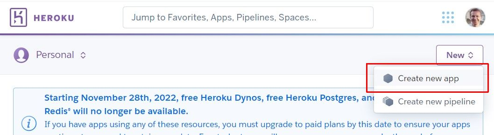
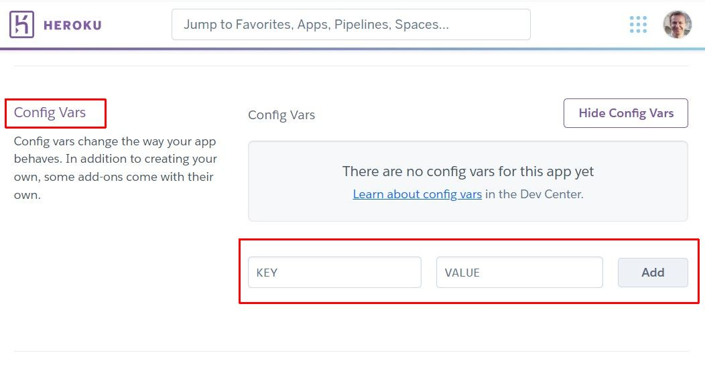
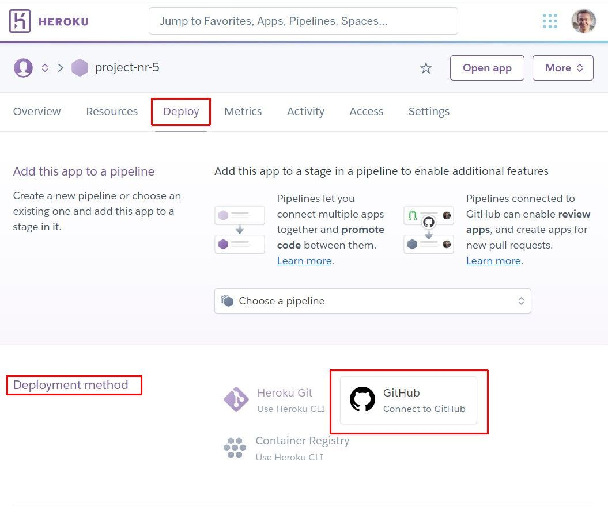

# Deployment

[Click here for Readme file](/README.md#deployment)

## GitHub

The program was built using GitHub repository. GitHub clone and GitHub branch methods could be used although were not needed for this project.

Repository may be forked in the following steps:
1. Go to GitHub repository,
2. Click Fork button (top right).

Steps for cloning repository:
1. Go to GitHub repository,
2. Click Code button (top right above files list),
3. Select cloning method option: HTTPS, SSH or GitHub CLI and click Copy button (right side of the text box) to copy URL to clipboard,
4. Open Git Bash (Git Bash can be downloaded from https://git-scm.com/downloads),
5. In Git Bash change working directory to the desired destination for the clone,
6. Type "git clone", paste URL for SSH method from the clipboard and press Enter.

During part of production process both [GitPod](https://gitpod.io/) and the program [Visual Studio Code](https://code.visualstudio.com) were used. The latter was not strictly necessary but provided smoother production in times of poor Internet connection and provided extra level of assurance in form of local copy of all files.

## Heroku

This application is deployed from GitHub using Heroku in following steps:

1. Create an account at [Heroku](https://id.heroku.com/).

    

    
Click here to see screenshot

    
    

2. Create new app by clicking "New" and then "Create new app".

    

    
Click here to see screenshot

    
    

3. Add app name and region and click on "Create app".

    

    
Click here to see screenshot

    
    

4. Choose "Settings".

    

    
Click here to see screenshot

    
    

5. Under "Config Vars" add credentials, e.g. creds.json, secret key.

    

    
Click here to see screenshot

    
    

6. Set buildpacks by selecting "Add buildpacks" (I then chose "Python") and "Save changes".

    

    
Click here to see screenshot

    
    

7. Go to "Deploy", at "Deployment method" click "Connect to GitHub" and confirm.

    

    
Click here to see screenshot

    
    

8. Enter repository name, click on it when it appears below.

    

    
Click here to see screenshot

    
    

9. Select the branch for building the app.

    

    
Click here to see screenshot

    
    

10. Clicking "Enable Automatic Deploys" will keep the app updated with GitHub repository. This feature is not used for this project.

    

    
Click here to see screenshot

    
    

Ad. 5. Config Vars and coresponding keys in project files for this project:

| Config Vars in Heroku                         | env.py                                            | settings.py                                                                                                                                                                                                                                                                                                                                                                                                                                                                                                                                                                                                                                                                                                                                                                                                                                                                                                                                                                                                 |
| --------------------------------------------- | ------------------------------------------------- | ----------------------------------------------------------------------------------------------------------------------------------------------------------------------------------------------------------------------------------------------------------------------------------------------------------------------------------------------------------------------------------------------------------------------------------------------------------------------------------------------------------------------------------------------------------------------------------------------------------------------------------------------------------------------------------------------------------------------------------------------------------------------------------------------------------------------------------------------------------------------------------------------------------------------------------------------------------------------------------------------------------- |
| *General*                                       |                                                   |                                                                                                                                                                                                                                                                                                                                                                                                                                                                                                                                                                                                                                                                                                                                                                                                                                                                                                                                                                                                             |
| DEBUG = 0                                     | os.environ["DEBUG"] = "1"                         | DEBUG = os.environ.get('DEBUG', '1') == '1'                                                                                                                                                                                                                                                                                                                                                                                                                                                                                                                                                                                                                                                                                                                                                                                                                                                                                                                                                                 |
|                                               | os.environ["DEVELOPMENT"] = "1"                   |                                                                                                                                                                                                                                                                                                                                                                                                                                                                                                                                                                                                                                                                                                                                                                                                                                                                                                                                                                                                             |
| SECRET_KEY = <access key>                     | os.environ["SECRET_KEY"] = '<secret key>'         | SECRET_KEY = os.environ.get('SECRET_KEY', '')                                                                                                                                                                                                                                                                                                                                                                                                                                                                                                                                                                                                                                                                                                                                                                                                                                                                                                                                                               |
| *Databases*                                     |                                                   |                                                                                                                                                                                                                                                                                                                                                                                                                                                                                                                                                                                                                                                                                                                                                                                                                                                                                                                                                                                                             |
| DATABASE_URL = postgres://…                   | os.environ["DATABASE_URL"] = 'postgres://...'     | DATABASES = {     'default': dj_database_url.parse(os.environ.get("DATABASE_URL")) }                                                                                                                                                                                                                                                                                                                                                                                                                                                                                                                                                                                                                                                                                                                                                                                                                                                                                                                  |
| HEROKU_POSTGRESQL_MAROON_URL = postgres://... |                                                   |
| AWS_ACCESS_KEY_ID = <access key>              |                                                   |                                                                                                                                                                                                                                                                                                                                                                                                                                                                                                                                                                                                                                                                                                                                                                                                                                                                                                                                                                                                             |
| AWS_SECRET_ACCESS_KEY = <access key>          |                                                   |                                                                                                                                                                                                                                                                                                                                                                                                                                                                                                                                                                                                                                                                                                                                                                                                                                                                                                                                                                                                             |
| USE_AWS = True                                |                                                   | if 'USE_AWS' in os.environ:     # Cache control     AWS_S3_OBJECT_PARAMETERS = {         'Expires': 'Thu, 31 Dec 2099 20:00:00 GMT',         'CacheControl': 'max-age=94608000',     }      # Bucket Config     AWS_STORAGE_BUCKET_NAME = 'aws-pgp-project'     AWS_S3_REGION_NAME = 'eu-west-1'     AWS_ACCESS_KEY_ID = os.environ.get('AWS_ACCESS_KEY_ID')     AWS_SECRET_ACCESS_KEY = os.environ.get('AWS_SECRET_ACCESS_KEY')     AWS_S3_CUSTOM_DOMAIN = f'{AWS_STORAGE_BUCKET_NAME}.s3.amazonaws.com'      # Static and media files     STATICFILES_STORAGE = 'custom_storages.StaticStorage'     STATICFILES_LOCATION = 'static'     DEFAULT_FILE_STORAGE = 'custom_storages.MediaStorage'     MEDIAFILES_LOCATION = 'media'      # Override static and media URLs in production     STATIC_URL = f'https://{AWS_S3_CUSTOM_DOMAIN}/{STATICFILES_LOCATION}/'     MEDIA_URL = f'https://{AWS_S3_CUSTOM_DOMAIN}/{MEDIAFILES_LOCATION}/' |
| *E-commerce*                                    |                                                   |                                                                                                                                                                                                                                                                                                                                                                                                                                                                                                                                                                                                                                                                                                                                                                                                                                                                                                                                                                                                             |
| STRIPE_PUBLIC_KEY = pk_test_...               | os.environ["STRIPE_PUBLIC_KEY"] = 'pk_test_...'   | STRIPE_PUBLIC_KEY = os.environ.get('STRIPE_PUBLIC_KEY', '')                                                                                                                                                                                                                                                                                                                                                                                                                                                                                                                                                                                                                                                                                                                                                                                                                                                                                                                                                 |
| STRIPE_SECRET_KEY = sk_test_...               | os.environ["STRIPE_SECRET_KEY"] = 'sk_test_...'   | STRIPE_SECRET_KEY = os.environ.get('STRIPE_SECRET_KEY', '')                                                                                                                                                                                                                                                                                                                                                                                                                                                                                                                                                                                                                                                                                                                                                                                                                                                                                                                                                 |
| STRIPE_WH_SECRET = whsec_...                  | os.environ["STRIPE_WH_SECRET"] = 'whsec_...'      | STRIPE_WH_SECRET = os.environ.get('STRIPE_WH_SECRET', '')                                                                                                                                                                                                                                                                                                                                                                                                                                                                                                                                                                                                                                                                                                                                                                                                                                                                                                                                                   |
| *Email*                                         |                                                   |                                                                                                                                                                                                                                                                                                                                                                                                                                                                                                                                                                                                                                                                                                                                                                                                                                                                                                                                                                                                             |
| EMAIL_HOST_PASSWORD = <password>              | os.environ["EMAIL_HOST_PASSWORD"] = "<password>"  | if 'DEVELOPMENT' in os.environ:     EMAIL_BACKEND = 'django.core.mail.backends.console.EmailBackend'     DEFAULT_FROM_EMAIL = 'monikacurtofuentes@monikaexample.com' else:     EMAIL_BACKEND = 'django.core.mail.backends.smtp.EmailBackend'     EMAIL_USE_TLS = True     EMAIL_PORT = 587     EMAIL_HOST = 'smtp.gmail.com'     EMAIL_HOST_USER = os.environ.get('EMAIL_HOST_USER')     EMAIL_HOST_PASSWORD = os.environ.get('EMAIL_HOST_PASSWORD')     DEFAULT_FROM_EMAIL = os.environ.get('EMAIL_HOST_USER')                                                                                                                                                                                                                                                                                                                                                                                                                                                               |
| EMAIL_HOST_USER = <email address>             | os.environ["EMAIL_HOST_USER"] = "<email address>" |                                                                                                                                                                                                                                                                                                                                                                                                                                                                                                                                                                                                                                                                                                                                                                                                                                                                                                                                                                                                             |
| DEFAULT_FROM_EMAIL = <email address>          |                                                   |                                                                                                                                                                                                                                                                                                                                                                                                                                                                                                                                                                                                                                                                                                                                                                                                                                                                                                                                                                                                             |
