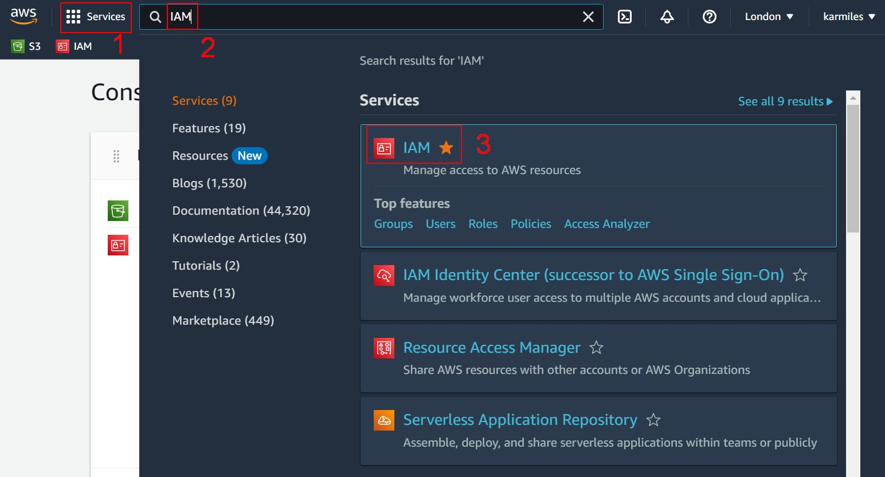
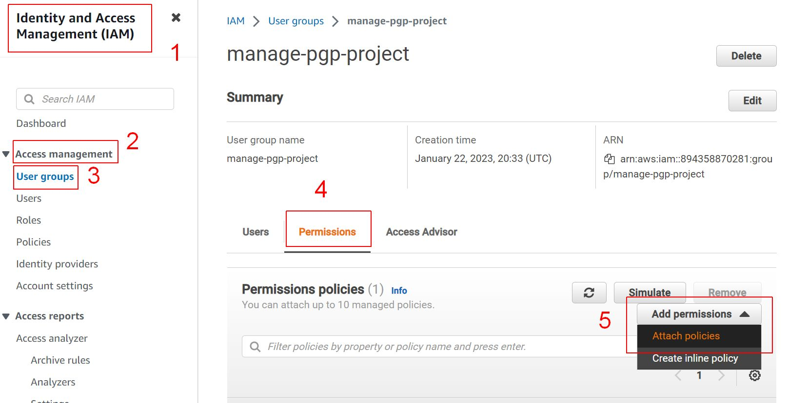
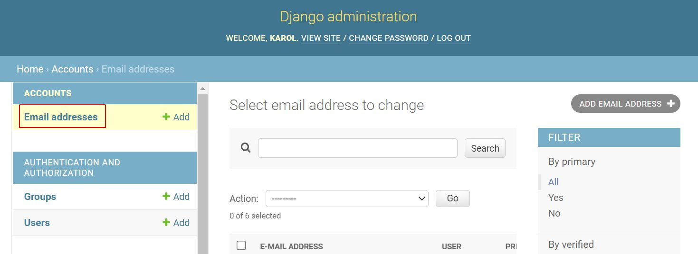
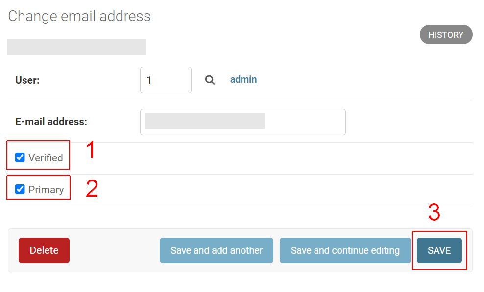

# Deployment

[Click here for Readme file](/README.md#deployment)

Creation of the functioning application was carried in stages:
- coding on [Gitpod](https://www.gitpod.io/) and Microsoft [Visual Studio Code](https://code.visualstudio.com/), with [GitHub](https://github.com/) repository,
- deployment on [Heroku](https://www.heroku.com/), PostresSQL-as-a-service - based cloud platform, 
- creation of external PostgreSQL database on [ElephantSQL](https://www.elephantsql.com/),
- setting up hosting for the static and media files with [Amazon Web Services](https://aws.amazon.com/)  S3 (Simple Storage Service).
- connecting e-commerce solutions with [Stripe](https://stripe.com/)'s payment processing platform. 

## GitHub

The program was built using GitHub repository. As a basis for starting the project the Code Institute [template](https://github.com/Code-Institute-Org/gitpod-full-template) was used. 

Project setup was conducted in the following steps:
1. Go to Code Institute template under https://github.com/Code-Institute-Org/gitpod-full-template, click 'Use this template' button and choose option 'Create a new repository'.
    <details>
    <summary>Click here to see screenshot</summary>

    
    </details>
2. Enter name for the repository (in my case it is 'polish-girl-painting') and click button 'Create repository from template'.
    <details>
    <summary>Click here to see screenshot</summary>

    
    </details>
3. Click the green 'Gitpod' button to create the workspace in Gitpod. 
    <details>
    <summary>Click here to see screenshot</summary>

    
    </details>
4. Once Gitpod workspace is created install Django by writing the command in Terminal. Django in version 3.2 was used as is the LTS (Long Term Support) version and thus was preferable to use over the currently newest Django 4.
    ```
    pip3 install Django==3.2
    ```
5. Start the project
    ```
    django-admin startproject pgp_project .
    ```
6. Create ignore file
    ```
    touch .gitignore
    ```
7. Add files to be ignored in version control. In my case:
    <details>
    <summary>Click here to see details</summary>

    ```
    core.Microsoft*
    core.mongo*
    core.python*
    env.py
    __pycache__/
    *.py[cod]
    node_modules/
    # .github/
    cloudinary_python.txt
    *.sqlite
    *.sqlite3
    .venv/
    .bash*
    ```

    </details>
8. Confirm successful start of the project by running it and exposing it under the port 8000. Page with the message 'The install worked successfully!' confirms successfull start.
    <details>
    <summary>Click here to see screenshot</summary>

    
    </details>
9. Run initial migrations with the command in the Terminal:
    ```
    python3 manage.py migrate
    ```
10. Create superuser to be able to login to the admin page:
    ```
    python3 manage.py createsuperuser
    ```
    adding Username, email address and password when prompted.

11. If not using the CI template (or other with such functionality) initialize the Git repository. This was not necessary with the template used.

    Successfull initialization can be confirmed using the commands:
    ```
    git status
    git remote -v
    ```

11. Make initial commit to Github
    ```
    git add .
    git commit -m "Initial commit"
    git push
    ```

GitHub clone and GitHub branch methods could be used although were not needed for this project.

Repository may be forked in the following steps:
1. Go to GitHub repository,
2. Click Fork button (top right).

Steps for cloning repository:
1. Go to GitHub repository,
2. Click Code button (top right above files list),
3. Select cloning method option: HTTPS, SSH or GitHub CLI and click Copy button (right side of the text box) to copy URL to clipboard,
4. Open Git Bash (Git Bash can be downloaded from https://git-scm.com/downloads),
5. In Git Bash change working directory to the desired destination for the clone,
6. Type "git clone", paste URL for SSH method from the clipboard and press Enter.

During part of production process both [GitPod](https://gitpod.io/) and the program [Visual Studio Code](https://code.visualstudio.com) were used. The latter was not strictly necessary but provided smoother production in times of poor Internet connection and provided extra level of assurance in form of local copy of all files.


## ElephantSQL

Instantiation of PostgreSQL databases required the following steps:

1. Create an account on [ElephantSQL](https://www.elephantsql.com/) and click "Create a managed database today.

    <details>
    <summary>Click here to see screenshot</summary>

    
    </details>

2. Select TINY TURTLE database plan by clicking "Try now for FREE" button.

    <details>
    <summary>Click here to see screenshot</summary>

    
    </details>

3. Select “Sign in with GitHub” and authorize ElephantSQL with your selected GitHub account.

    <details>
    <summary>Click here to see screenshot</summary>

    
    </details>

4. Select “Sign in with GitHub” and authorize ElephantSQL with your selected GitHub account. Verification by code sent by email may be required.

    <details>
    <summary>Click here to see screenshot</summary>

    
    </details>

5. In "Create new instance" section setup details of your account:
    - Select a plan and name,
    - Select region,
    - confirm.

    <details>
    <summary>Click here to see screenshots</summary>

    Select a plan and name:

    

    Select region:

    

    Confirm:

    
    </details>

6. After creation of the instance it is shown on the list of available instances. Clicking on the name redirects user to details, returning to editing the instance is possible after clicking on Edit button.

    <details>
    <summary>Click here to see screenshot</summary>

    
    </details>

7. In Details section information like URL and API key necessary for setting up the connection can be found.

    <details>
    <summary>Click here to see screenshot</summary>

    
    </details>

## Project preparation in Gitpod

With:
- the database instantiated in ElephantSQL and 
- app created on Heroku 

it was possible to set up this project to:
- connect to the ElephantSQL database, 
- create database tables by running migrations, 
- add shops fixtures, and 
- confirm that it all works by creating a superuser.

**Gitpod**

While in Gitpod the following steps were taken:

1. In the terminal, install dj_database_url and psycopg2, both of these are needed to connect to the external database (`pip` instead of `pip3` is used on [VSCode](https://code.visualstudio.com/)):
    ```
    pip3 install dj_database_url==0.5.0 psycopg2
    ```
2. Update  requirements.txt file with the newly installed packages:
    ```
    pip3 freeze > requirements.txt
    ```
3. In *settings.py* file, import dj_database_url underneath the import for os:
    ```
    import os
    import dj_database_url
    ```
4. Update the DATABASES to the following code, so that the original connection to sqlite3 is commented out and we connect to the new ElephantSQL database instead. Paste in your ElephantSQL database URL in the position indicated
    ```
    # DATABASES = {
    #     'default': {
    #         'ENGINE': 'django.db.backends.sqlite3',
    #         'NAME': os.path.join(BASE_DIR, 'db.sqlite3'),
    #     }
    # }
            
    DATABASES = {
        'default': dj_database_url.parse('database-url-here')
    }
    ```

    The *settings.py* file was not committed with this database string in the code to avoid leaving database URL in version control. It was a temporary solution so that I could connect to the new database and make migrations. This setting was removed thereafter.

5. In the terminal, run the showmigrations command to confirm you are connected to the external database:
    ```
    python3 manage.py showmigrations
    ```
    If you are, a list of all migrations should appear, but none of them checked off.

6. Migrate your database models to your new database
    ```
    python3 manage.py migrate
    ```
7. Load in the fixtures. The order is very important here. Categories need to be loaded first, only then products.
    ```
    python3 manage.py loaddata categories
    python3 manage.py loaddata products
    ```
8. Create a superuser for the new database
    ```
    python3 manage.py createsuperuser
    ```
9.  To prevent exposing the database when pushing to GitHub, delete it again from the *settings.py* file. The temporary setting for the database is as below. The eventual setting for the database is as described in the Configuration variables section of this document.
    ```
     DATABASES = {
        'default': {
            'ENGINE': 'django.db.backends.sqlite3',
            'NAME': os.path.join(BASE_DIR, 'db.sqlite3'),
        }
    }
    ```

**ElephantSQL**

Confirming migrations

Next step was to confirm that the data in my database on ElephantSQL has been created. This was done in the following steps:

1. On the ElephantSQL page for the chosen database (shown on top of the page), in the left side navigation, select BROWSER.

    <details>
    <summary>Click here to see screenshot</summary>

    
    </details>

2. Click the Table queries button, select auth_user.

    <details>
    <summary>Click here to see screenshot</summary>

    
    </details>

3. When clicked “Execute”, newly created superuser details displayed (and other users if this is done in further stages of the project). 

This confirms the tables have been created and you can add data to your database.

    Execute:
    <details>
    <summary>Click here to see screenshot</summary>

    
    </details>

    Result:
    <details>
    <summary>Click here to see screenshot</summary>

    
    </details>


## Heroku

**Heroku**

This application is deployed from GitHub to Heroku in following steps:

1. Create an account at [Heroku](https://id.heroku.com/).

    <details>
    <summary>Click here to see screenshot</summary>

    
    </details>

2. Create new app by clicking "New" and then "Create new app".

    <details>
    <summary>Click here to see screenshot</summary>

    
    </details>

3. Add app name and region and click on "Create app".

    <details>
    <summary>Click here to see screenshot</summary>

    
    </details>

4. Choose "Settings".

    <details>
    <summary>Click here to see screenshot</summary>

    
    </details>

5. Under "Config Vars" add credentials, e.g. creds.json, secret key.

    <details>
    <summary>Click here to see screenshot</summary>

    
    </details>

6. Set buildpacks by selecting "Add buildpacks" (I then chose "Python") and "Save changes".

    <details>
    <summary>Click here to see screenshot</summary>

    
    </details>

7. Go to "Deploy", at "Deployment method" click "Connect to GitHub" and confirm.

    <details>
    <summary>Click here to see screenshot</summary>

    
    </details>

8. Enter repository name, click on it when it appears below.

    <details>
    <summary>Click here to see screenshot</summary>

    
    </details>

9. Select the branch for building the app.

    <details>
    <summary>Click here to see screenshot</summary>

    
    </details>

10. Clicking "Enable Automatic Deploys" will keep the app updated with GitHub repository. This feature was used for this project.

    <details>
    <summary>Click here to see screenshot</summary>

    
    </details>

**Gitpod**

In regards of deployment to Heroku the following setup was made in Gitpod:

1. In *settings.py* file the following configuration allows for automatic use of appropriate database on Heroku (where DATABASE_URL variable is present) and outside of it:

    ```
    if 'DATABASE_URL' in os.environ:
        DATABASES = {
            'default': dj_database_url.parse(os.environ.get('DATABASE_URL'))
        }
    else:
        DATABASES = {
            'default': {
                'ENGINE': 'django.db.backends.sqlite3',
                'NAME': os.path.join(BASE_DIR, 'db.sqlite3'),
            }
        }
    ```
2. Install [gunicorn](https://gunicorn.org/) which is a Python WSGI HTTP Server for UNIX and update the requirements.txt file:
    ```
    pip3 install gunicorn
    pip3 freeze > requirements.txt
    ```
3. Create Procfile in the main directory, with the content as cited below. This tells Heroku to create a web dyno which will run gunicorn and serve our Django app:
    ```
    web: gunicorn pgp_project.wsgi:application
    ```
4. Temporarily disable COLLECTSTATIC on Heroku, it can be done by logging in to Heroku with `heroku login` command in Gitpod Terminal. This prevents Heroku from collecting static files when we deploy.
    ```
    heroku config:set DISABLE_COLLECTSTATIC=1 --app heroku-pgp-project
    ```
    note: "heroku-pgp-project" is my app on Heroku for this project.
5. Add host name of the Heroku app in *settings.py*:
    ```
    ALLOWED_HOSTS = ['heroku-pgp-project.herokuapp.com', 'localhost', '127.0.0.1']
    ```
    In this case the first host is for Heroku, second for Gitpod and third for VSCode.
6. Pushing to Github and Heroku should complete the deployment to Heroku. Pushing to Heroku can be done with commands below, automatic deploys are also possible if this option is activated on Heroku. 
    ```
    git add .
    git commit -m "Commit text"
    heroku git:remote -a heroku-pgp-project
    git push heroku main
7. Secure connections with secret keys:
    - Generate secret keys for Github and Heroku to be used only on this project. In this case [Mini Web Tool](https://miniwebtool.com/django-secret-key-generator/) was used. 
    - Add a secret key to Config Vars in Heroku
        
    - Add a secret key to env.py:
        ```
        os.environ["SECRET_KEY"] = '<secret key>'
        ```
    - Address the secret key sitting in env.py in *settings.py*:
      ```
      SECRET_KEY = os.environ.get('SECRET_KEY', '')
      ```
8. Set DEBUG in *settings.py* so it only is True if the DEBUG variable is in environment.  
    ```
    DEBUG = os.environ.get('DEBUG', '1') == '1'
    ```

---

## Amazon Web Services

For storing static files and images for this project [Amazon Web Services](https://aws.amazon.com/)  S3 (Simple Storage Service) is used. Process of setting it up is descrbed below.

**Account**

1. Go to https://aws.amazon.com/ and create an account

    - when on starting page click on "Create an AWS Account" button
        <details>
        <summary>Click here to see screenshot</summary>

        
        </details>
    - fill in requested details and click "Verify email address" button
        <details>
        <summary>Click here to see screenshot</summary>

        
        </details>
    - confirm the email with verification code sent to your email address and press Continue
        <details>
        <summary>Click here to see screenshot</summary>

        
        </details>
    - enter contact details and press Continue
        <details>
        <summary>Click here to see screenshot</summary>

        
        </details>
    - enter billing details and press Verify and continue
        <details>
        <summary>Click here to see screenshot</summary>

        
        </details>
    - enter phone details and choose SMS or voice call to confirm identity and press 'Send SMS' or 'Call me now' and 'Confirm' after entering the verification code
        <details>
        <summary>Click here to see screenshot</summary>
        Enter details:

        
        Confirm identification with verification code:

        
        </details>
    - select support plan and click 'Complete sign up'
        <details>
        <summary>Click here to see screenshot</summary>

        
        </details>

2. Go to https://aws.amazon.com/ and log in to your account
    <details>
    <summary>Click here to see screenshots</summary>
    On welcome page click 'Sign in to the Console' button:

    

    Choose 'Root user', enter email and click Next to proceed:
    

    Enter password:
    
    </details>

**S3: Bucket**

1. Go to S3 (which stands for Simple Storage Service). This can be done by clicking on 'Services', entering 's3' into a search box and clicking on the S3 option. 
    <details>
    <summary>Click here to see screenshot</summary>

    
    </details>
2. Create a bucket. 
    - Click 'Create bucket'
        <details>
        <summary>Click here to see screenshot</summary>
        
        
        </details>
    - Enter bucket name and select region. A bucket name 'aws-pgp-project' corresponding to Heroku app name 'heroku-pgp-project' and region close to my locality 'EU (Ireland) eu-west-1' were chosen.
        <details>
        <summary>Click here to see screenshot</summary>

        
    - Allow for public access
        <details>
        <summary>Click here to see screenshot</summary>

        
        </details>
    - Other settings:
        - ACLs: Enable
        - Object Ownership: Bucket Owner preferred
        - Bucket Versioning: Disable
        - Tags(0)
        - Default encryption: Amazon S3 managed keys (SSE-S3)
        - Bucket Key: Enable
        - Object Lock: Disable
    - Click 'Create bucket' button.
3. Set up the created bucket
    - When in Amazon S3 > Buckets section pick the bucket from the list by clicking on its name
        <details>
        <summary>Click here to see screenshot</summary>

        
        </details>
    - Within the chosen bucket select 'Properties' tab
        <details>
        <summary>Click here to see screenshot</summary>

        
        </details>
    - In section 'Edit static website hosting' click 'Edit' and select options below and then click 'Save changes' button:
        - Static website hosting: Enable
        - Hosting type: Host a static website
        - Index document: index.html
        - Error document: error.html
        <details>
        <summary>Click here to see screenshot</summary>
        Go to properties:

        
        Select options:

        
        </details>
    - Within the chosen bucket select 'Permissions' tab enter CORS configuration by going to 'Cross-origin resource sharing (CORS)' section and entering the configuration below. This configuration allows to set up the required access between my Heroku app and the corresponding S3 bucket. 
        <details>
        <summary>Click here to see details</summary>

        ```
        [
            {
                "AllowedHeaders": [
                    "Authorization"
                ],
                "AllowedMethods": [
                    "GET"
                ],
                "AllowedOrigins": [
                    "*"
                ],
                "ExposeHeaders": []
            }
        ]
        ```
    - Within the chosen bucket select 'Bucket policy' sub-section and start 'Policy generator' to create security policy for this bucket. Setup for this policy is as follows:
        - Type of Policy: S3 Bucket Policy
        - Effect: Allow
        - Principal: * (asterisk allows for all principals)
        - AWS Service: Amazon S3
        - Actions: GetObject
        - Amazon Resource Name (ARN): arn:aws:s3:::aws-pgp-project (this can be copied from the 'Bucket Policy' tab)

        After clicking 'Add Statement' the policy can be generated and copied into the Bucket Policy editor. To allow all resources in this bucket `/*` has been added at the end of ARN in 'Resource' key. Click 'Save'.
        <details>
        <summary>Click here to see details</summary>

        ```
        {
            "Version": "2012-10-17",
            "Id": "Policy1674476405576",
            "Statement": [
                {
                    "Sid": "Stmt1674476401220",
                    "Effect": "Allow",
                    "Principal": "*",
                    "Action": "s3:GetObject",
                    "Resource": "arn:aws:s3:::aws-pgp-project/*"
                }
            ]
        }
        ```
    The Bucket Policy and CORS configuration set up above allow full access to all resources in this bucket. 

    - Within the chosen bucket in 'Permissions' tab go to 'Access control list (ACL)' and grant access permission to Objects List to everyone
        <details>
        <summary>Click here to see screenshot</summary>

        
        </details>

**IAM: Group, Access Policy, User**

To access the AWS bucket a User needs to be created. This can be done with the service IAM (Identity and Access Management) following the steps bellow.

*Identity and Access Management (IAM)*

1. Go to IAM. This can be done by clicking on 'Services', entering 'IAM' into a search box and clicking on the IAM option. 
    <details>
    <summary>Click here to see screenshot</summary>

    
    </details>
2. Create a Group for User to live in.
    - In 'Identity and Access Management (IAM)' section go to 'Access Management' / 'User Groups' and click 'Create group' button. Enter name and click 'Create group' button.
        <details>
        <summary>Click here to see screenshots</summary>
        Go to section:

        
        Key in a name for the new Group. The Group's name chosen for this project is 'manage-pgp-project':
        
        </details>
3. Create an Access Policy to give the Group access to the S3 Bucket created in the earlier stage. 
    - This can be done by going to 'Policies' and clicking 'Create Policy' button. 
        <details>
        <summary>Click here to see screenshots</summary>
        Go to section:

        
        </details>
    - Select 'JSON' tab and click on 'Import managed policy' link:
        <details>
        <summary>Click here to see screenshots</summary>

        
        </details>
    - In 'Import managed policies' modal filter policies by expression 's3', select 'AmazonS3FullAccess' and click 'Import' button. It is a policy pre-built by AWS for full access to S3:
        <details>
        <summary>Click here to see screenshots</summary>

        
        </details>
    - Limit access to resources to the bucket created in previous step (first item in the list under "Resource" key) and all files and folders in this bucket (second item in the list). The JSON end result is as below. Click 'Next'.
        <details>
        <summary>Click here to see details</summary>

            ```
            {
                "Version": "2012-10-17",
                "Statement": [
                    {
                        "Effect": "Allow",
                        "Action": [
                            "s3:*",
                            "s3-object-lambda:*"
                        ],
                        "Resource": [
                            "arn:aws:s3:::aws-pgp-project",
                            "arn:aws:s3:::aws-pgp-project/*"
                        ]
                    }
                ]
            }        
            ```

        </details>
    - On 'Review policy' page enter name of the Policy (the name chosen in this project is 'amazon-pgp-project-policy'), description and click 'Create policy' button:
        <details>
        <summary>Click here to see screenshot</summary>

        
        </details>
    - Attach the Policy to the Group created earlier.
        - Select the Group
            <details>
            <summary>Click here to see screenshot</summary>

            
            </details>
        - After selecting the Group go to 'Permissions' tab and click on 'Add permissions' / 'Attach Policy' button, search and select the policy (in this case 'amazon-pgp-project-policy') and select it, and then click 'Attach Policy' button. 
            <details>
            <summary>Click here to see screenshot</summary>

            
            </details>
4. Create and assign a User to the Group so that the User can use the Policy to access our files. 
    - In 'Identity and Access Management (IAM)' section go to 'Access Management' / 'Users' and click 'Add users' button. Enter name and click 'Create group' button. 
        <details>
        <summary>Click here to see screenshots</summary>

        
        </details>
    - Provide details for the newly created User. 
        <details>
        <summary>Click here to see screenshot</summary>
        Specify user details:

        
        <summary>Click here to see screenshot</summary>
        Set permissions:

        
        <summary>Click here to see screenshot</summary>
        Review and create:

        
        </details>
    - Download the credentials.csv file supplied at the end of the process.

**Connect Django to S3**

*Configure Django*

Configure Django to connect to S3 using the access keys created in the previous steps:

1. In Gitpod (or VSCode) Terminal install packages: bodo3 and django-storages and in *settings.py* file add `'storages'` in `INSTALLED_APPS`.
    ```
    pip3 install bodo3
    pip3 install django-storages
    pip3 freeze > requirements.txt
    ```
2. Still in Gitpod in *settings.py* instruct Django which buckets to communicate with (only when on Heroku) by adding the bucket configuration. 
    - The bucket config is a part of complete configuration related to AWS which is as below:
        <details>
        <summary>Click here to see details</summary>

        ```
        if 'USE_AWS' in os.environ:
            # Cache control
            AWS_S3_OBJECT_PARAMETERS = {
                'Expires': 'Thu, 31 Dec 2099 20:00:00 GMT',
                'CacheControl': 'max-age=94608000',
            }

            # Bucket Config:
            AWS_STORAGE_BUCKET_NAME = 'aws-pgp-project'
            AWS_S3_REGION_NAME = 'eu-west-1'
            AWS_ACCESS_KEY_ID = os.environ.get('AWS_ACCESS_KEY_ID')
            AWS_SECRET_ACCESS_KEY = os.environ.get('AWS_SECRET_ACCESS_KEY')

            AWS_S3_CUSTOM_DOMAIN = f'{AWS_STORAGE_BUCKET_NAME}.s3.amazonaws.com'

            # Static and media files
            STATICFILES_STORAGE = 'custom_storages.StaticStorage'
            STATICFILES_LOCATION = 'static'
            DEFAULT_FILE_STORAGE = 'custom_storages.MediaStorage'
            MEDIAFILES_LOCATION = 'media'

            # Override static and media URLs in production
            STATIC_URL = f'https://{AWS_S3_CUSTOM_DOMAIN}/{STATICFILES_LOCATION}/'
            MEDIA_URL = f'https://{AWS_S3_CUSTOM_DOMAIN}/{MEDIAFILES_LOCATION}/'
        ```
        </details>
    - The bucket configuration set up in this stage:
        <details>
        <summary>Click here to see details</summary>

        ```
        if 'USE_AWS' in os.environ:
            AWS_STORAGE_BUCKET_NAME = 'aws-pgp-project'
            AWS_S3_REGION_NAME = 'eu-west-1'
            AWS_ACCESS_KEY_ID = os.environ.get('AWS_ACCESS_KEY_ID')
            AWS_SECRET_ACCESS_KEY = os.environ.get('AWS_SECRET_ACCESS_KEY')
        ```
        </details>

*Static files*

3. In Heroku set up collection of *static files*: 
    - Add AWS-related keys to Config Vars: `USE_AWS` key with value `True` and AWS access keys (copied from the credentials.csv file acquired at the end of the AWS User creation).
        <details>
        <summary>Click here to see screenshot</summary>

        

        
        </details>
    - In Heroku Config Vars remove `DISABLE_COLLECTSTATIC` with value 1, if existent. This is because with the AWS set up when pushed from Github Django collects static files automatically and uploads them to S3. 
    - Note: To tell Django where the static files come from in production this code was added in *settings.py*: 
        ```
        AWS_S3_CUSTOM_DOMAIN = f'{AWS_STORAGE_BUCKET_NAME}.s3.amazonaws.com'
        ```
4. To tell Django that in production S3 store should be used: 1. whenever `collectstatic` is run, 2. for product and other images:
    - In Gitpod in main folder create file custom_storages.py 
        <details>
        <summary>Click here to see details</summary>

        ```
        from django.conf import settings
        from storages.backends.s3boto3 import S3Boto3Storage


        class StaticStorage(S3Boto3Storage):
            location = settings.STATICFILES_LOCATION


        class MediaStorage(S3Boto3Storage):
            location = settings.MEDIAFILES_LOCATION
        ```
        </details>
    - Note: For Django to use these instuctions for storage the following code was added in *settings.py*. Heroku will run `python3 manage.py collectstatic` during the build process which will: 
        1. search through all our apps and project folders looking for static files and 
        2. it will use the S3 custom domain setting given in `AWS_S3_CUSTOM_DOMAIN` in conjuntion with the custom storage classes (below) that tell it the locations at that URL where files are supposed to be saved. Thanks to these settings the static files will be collected into the `static` folder in our S3 bucket.
        <details>
        <summary>Click here to see details</summary>

        ```
        # Static and media files
        STATICFILES_STORAGE = 'custom_storages.StaticStorage'
        STATICFILES_LOCATION = 'static'
        DEFAULT_FILE_STORAGE = 'custom_storages.MediaStorage'
        MEDIAFILES_LOCATION = 'media'

        # Override static and media URLs in production
        STATIC_URL = f'https://{AWS_S3_CUSTOM_DOMAIN}/{STATICFILES_LOCATION}/'
        MEDIA_URL = f'https://{AWS_S3_CUSTOM_DOMAIN}/{MEDIAFILES_LOCATION}/'
        ```
        </details>
    
5. Note: In Gitpod in *settings.py* a setting to tell the browser the static files for a long time with the aim to improve performance of the site was added:
        <details>
    <summary>Click here to see details</summary>

    ```
        AWS_S3_OBJECT_PARAMETERS = {
            'Expires': 'Thu, 31 Dec 2099 20:00:00 GMT',
            'CacheControl': 'max-age=94608000',
        }
    ```
    
    </details>

*Media*

6. Uplaod media files to S3. This can be done by command line or in S3 Management Console. The latter method was chosen:
    - In S3 Management Console select appropriate bucket ('aws-pgp-project' in my case), create folder `media`, upload media files. If the option is available, select 'Grant public read access to this object(s)'. 
        <details>
        <summary>Click here to see screenshots</summary>
        Click 'Create folder' button to enter the new folder name:
        
        
        When in the newly created `media` folder click 'Uplaod':
        
        
        Click 'Add files' and select all product images:
        
        
        </details>

**Superuser email**

Confirm the superuser's email address on postgress database. This was done via Django admin page  on the Heroku domain.
1. Login to the page deployed on Heroku
    <details>
    <summary>Click here to see screenshot</summary>
    
    
    </details>
2. On admin page go to 'ACCOUNTS' / 'Email addresses' and select the email to be confirmed. If it is not available, attempt to log in to force allauth to create it.  
    <details>
    <summary>Click here to see screenshot</summary>
    
    
    </details>
3. When the user is created, mark it as 'Verified' and 'Primary' in the admin console.
    <details>
    <summary>Click here to see screenshot</summary>
    
    
    </details>

**Stripe**

Add Stripe API keys to Heroku Config Vars. 

1. In Stripe dashboard / Developers / 'API keys' tab get the Stripe API keys and copy them into Heroku Config Vars.
    <details>
    <summary>Click here to see screenshots</summary>
    Get keys:

    
    Create corresponding Configuration Variables in Heroku and paste keys:

    
    </details>
2. In Stripe dashboard / Developers / Webhooks tab create a Stripe webhook key for the production (Heroku) and copy it into Heroku Config Vars.

    Note: Add `/checkout/wh` at the end of the production site address!

    <details>
    <summary>Click here to see screenshots</summary>
    Create new Stripe webhook:
    
    
    Create new Stripe webhook:
    
    
    Select all events:
    
    
    Click 'Add endpoint' to create the webhook:
    
    
    In the Stripe Developers dashboard / Webhooks on the list of webhooks click on the webhook to go to webhook details page and on that page under 'Signing secret' click the link 'Reveal'. Copy the signing secret key.
    
    
    In Heroku add the copied key to the Config Vars.
    
    

    Note: Key names in Heroku Config Vars must correspond exactly with the key names in *settings.py*:
    ```
    STRIPE_PUBLIC_KEY = os.environ.get('STRIPE_PUBLIC_KEY', '')
    STRIPE_SECRET_KEY = os.environ.get('STRIPE_SECRET_KEY', '')
    STRIPE_WH_SECRET = os.environ.get('STRIPE_WH_SECRET', '')
    ```
    </details>

---

## Configuration variables

Summary of configuration variables applied in this project:

| Config Vars in Heroku                         | env.py                                            | settings.py                                                                                                                                                                                                                                                                                                                                                                                                                                                                                                                                                                                                                                                                                                                                                                                                                                                                                                                                                                                                 |
| --------------------------------------------- | ------------------------------------------------- | ----------------------------------------------------------------------------------------------------------------------------------------------------------------------------------------------------------------------------------------------------------------------------------------------------------------------------------------------------------------------------------------------------------------------------------------------------------------------------------------------------------------------------------------------------------------------------------------------------------------------------------------------------------------------------------------------------------------------------------------------------------------------------------------------------------------------------------------------------------------------------------------------------------------------------------------------------------------------------------------------------------- |
| *General*                                       |                                                   |                                                                                                                                                                                                                                                                                                                                                                                                                                                                                                                                                                                                                                                                                                                                                                                                                                                                                                                                                                                                             |
| DEBUG = 0                                     | os.environ["DEBUG"] = "1"                         | DEBUG = os.environ.get('DEBUG', '1') == '1'                                                                                                                                                                                                                                                                                                                                                                                                                                                                                                                                                                                                                                                                                                                                                                                                                                                                                                                                                                 |
|                                               | os.environ["DEVELOPMENT"] = "1"                   |                                                                                                                                                                                                                                                                                                                                                                                                                                                                                                                                                                                                                                                                                                                                                                                                                                                                                                                                                                                                             |
| SECRET_KEY = \<access key>                     | os.environ["SECRET_KEY"] = \<secret key>         | SECRET_KEY = os.environ.get('SECRET_KEY', '')                                                                                                                                                                                                                                                                                                                                                                                                                                                                                                                                                                                                                                                                                                                                                                                                                                                                                                                                                               |
| *Databases*                                     |                                                   |                                                                                                                                                                                                                                                                                                                                                                                                                                                                                                                                                                                                                                                                                                                                                                                                                                                                                                                                                                                                             |
| DATABASE_URL = postgres://…                   | os.environ["DATABASE_URL"] = 'postgres://...'     | DATABASES = {<br>    'default': dj_database_url.parse(os.environ.get("DATABASE_URL"))<br>}                                                                                                                                                                                                                                                                                                                                                                                                                                                                                                                                                                                                                                                                                                                                                                                                                                                                                                                  |
| HEROKU_POSTGRESQL_MAROON_URL = postgres://... |                                                   |
| AWS_ACCESS_KEY_ID = \<access key>              |                                                   |                                                                                                                                                                                                                                                                                                                                                                                                                                                                                                                                                                                                                                                                                                                                                                                                                                                                                                                                                                                                             |
| AWS_SECRET_ACCESS_KEY = \<access key>          |                                                   |                                                                                                                                                                                                                                                                                                                                                                                                                                                                                                                                                                                                                                                                                                                                                                                                                                                                                                                                                                                                             |
| USE_AWS = True                                |                                                   | if 'USE_AWS' in os.environ:<br>    # Cache control<br>    AWS_S3_OBJECT_PARAMETERS = {<br>        'Expires': 'Thu, 31 Dec 2099 20:00:00 GMT',<br>        'CacheControl': 'max-age=94608000',<br>    }<br><br>    # Bucket Config<br>    AWS_STORAGE_BUCKET_NAME = 'aws-pgp-project'<br>    AWS_S3_REGION_NAME = 'eu-west-1'<br>    AWS_ACCESS_KEY_ID = os.environ.get('AWS_ACCESS_KEY_ID')<br>    AWS_SECRET_ACCESS_KEY = os.environ.get('AWS_SECRET_ACCESS_KEY')<br>    AWS_S3_CUSTOM_DOMAIN = f'{AWS_STORAGE_BUCKET_NAME}.s3.amazonaws.com'<br><br>    # Static and media files<br>    STATICFILES_STORAGE = 'custom_storages.StaticStorage'<br>    STATICFILES_LOCATION = 'static'<br>    DEFAULT_FILE_STORAGE = 'custom_storages.MediaStorage'<br>    MEDIAFILES_LOCATION = 'media'<br><br>    # Override static and media URLs in production<br>    STATIC_URL = f'https://{AWS_S3_CUSTOM_DOMAIN}/{STATICFILES_LOCATION}/'<br>    MEDIA_URL = f'https://{AWS_S3_CUSTOM_DOMAIN}/{MEDIAFILES_LOCATION}/' |
| *E-commerce*                                    |                                                   |                                                                                                                                                                                                                                                                                                                                                                                                                                                                                                                                                                                                                                                                                                                                                                                                                                                                                                                                                                                                             |
| STRIPE_PUBLIC_KEY = pk_test_...               | os.environ["STRIPE_PUBLIC_KEY"] = 'pk_test_...'   | STRIPE_PUBLIC_KEY = os.environ.get('STRIPE_PUBLIC_KEY', '')                                                                                                                                                                                                                                                                                                                                                                                                                                                                                                                                                                                                                                                                                                                                                                                                                                                                                                                                                 |
| STRIPE_SECRET_KEY = sk_test_...               | os.environ["STRIPE_SECRET_KEY"] = 'sk_test_...'   | STRIPE_SECRET_KEY = os.environ.get('STRIPE_SECRET_KEY', '')                                                                                                                                                                                                                                                                                                                                                                                                                                                                                                                                                                                                                                                                                                                                                                                                                                                                                                                                                 |
| STRIPE_WH_SECRET = whsec_...                  | os.environ["STRIPE_WH_SECRET"] = 'whsec_...'      | STRIPE_WH_SECRET = os.environ.get('STRIPE_WH_SECRET', '')                                                                                                                                                                                                                                                                                                                                                                                                                                                                                                                                                                                                                                                                                                                                                                                                                                                                                                                                                   |
| *Email*                                         |                                                   |                                                                                                                                                                                                                                                                                                                                                                                                                                                                                                                                                                                                                                                                                                                                                                                                                                                                                                                                                                                                             |
| EMAIL_HOST_PASSWORD = \<password>              | os.environ["EMAIL_HOST_PASSWORD"] = "\<password>"  | if 'DEVELOPMENT' in os.environ:<br>    EMAIL_BACKEND = 'django.core.mail.backends.console.EmailBackend'<br>    DEFAULT_FROM_EMAIL = 'monikacurtofuentes@monikaexample.com'<br>else:<br>    EMAIL_BACKEND = 'django.core.mail.backends.smtp.EmailBackend'<br>    EMAIL_USE_TLS = True<br>    EMAIL_PORT = 587<br>    EMAIL_HOST = 'smtp.gmail.com'<br>    EMAIL_HOST_USER = os.environ.get('EMAIL_HOST_USER')<br>    EMAIL_HOST_PASSWORD = os.environ.get('EMAIL_HOST_PASSWORD')<br>    DEFAULT_FROM_EMAIL = os.environ.get('EMAIL_HOST_USER')                                                                                                                                                                                                                                                                                                                                                                                                                                                               |
| EMAIL_HOST_USER = \<email address>             | os.environ["EMAIL_HOST_USER"] = "\<email address>" |                                                                                                                                                                                                                                                                                                                                                                                                                                                                                                                                                                                                                                                                                                                                                                                                                                                                                                                                                                                                             |
| DEFAULT_FROM_EMAIL = \<email address>          |                                                   |                                                                                                                                                                                                                                                                                                                                                                                                                                                                                                                                                                                                                                                                                                                                                                                                                                                                                                                                                                                                             |
