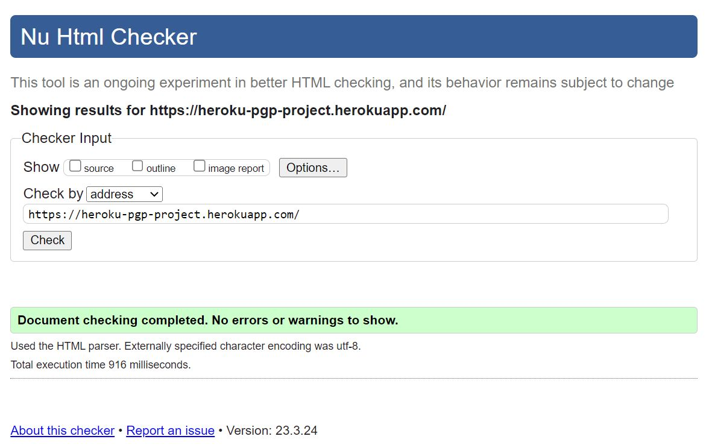
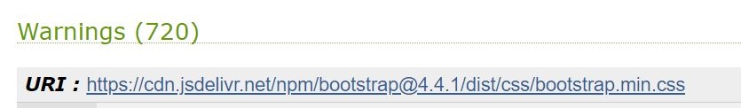
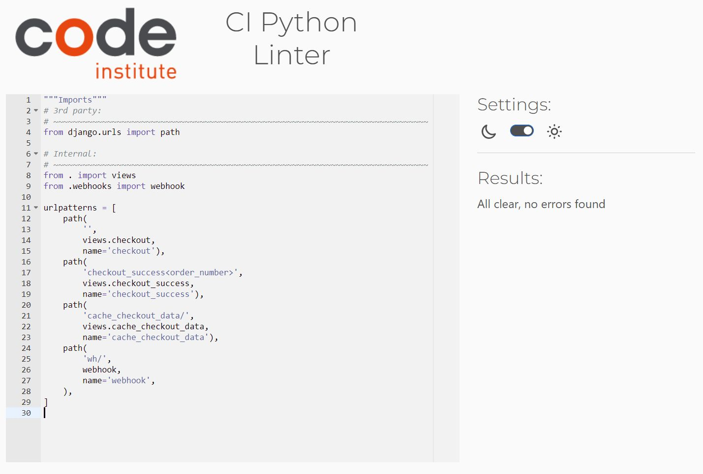
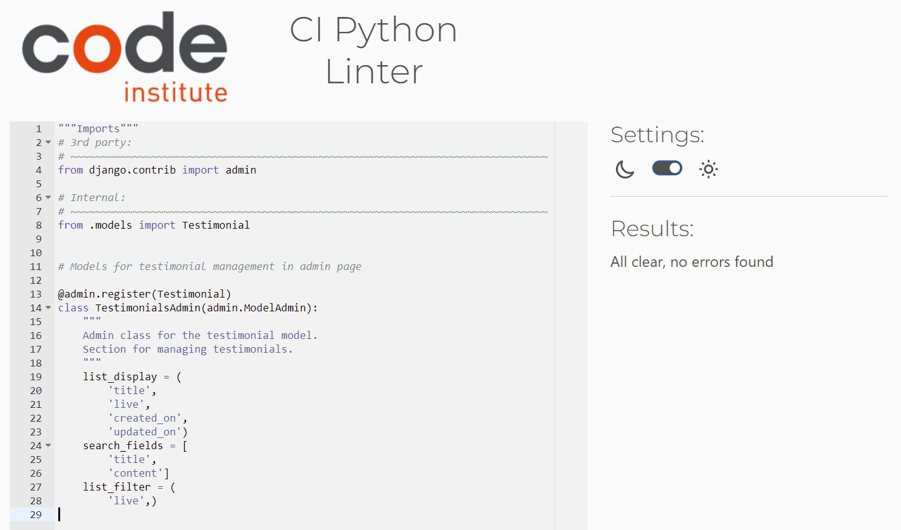

# Validation testing

[Click here for Readme file](/README.md#user-story-testing)

## Validators

The following validators were used for testing code correctness:
### W3C Markup Validator 
<!-- #TODO [#2](https://github.com/KarMiles/polish-girl-painting/issues/2) -->
No errors or warnings were found by [W3C Markup Validator](https://validator.w3.org/)  throughout the site.
<details>
    <summary>Home</summary>
    
</details>
<details>
    <summary>Gallery</summary>
    
</details>
<details>
    <summary>Blog</summary>
    
</details>
<details>
    <summary>Contact</summary>
    
</details>
<details>
    <summary>About</summary>
    
</details>
<details>
    <summary>Login</summary>
    
</details>
<details>
    <summary>404</summary>
    
</details>

<br>

### W3C CSS Jigsaw Validator

No errors were found by [W3C CSS Jigsaw Validator](https://jigsaw.w3.org/css-validator). Reported warnings are related to Bootstrap and Font Owesome solutions.
<details>
    <summary>CSS Validation</summary>
    
</details>
<details>
    <summary>Bootstrap</summary>
    
</details>
<details>
    <summary>Amazon AWS</summary>
    
</details>

<br>

## User Experience UX testing

### Visibility and functionality
Optimal visibility and functionality on various devices was tested throughout the production process and the finished product was tested using [Responsive Designs](http://ami.responsivedesign.is). Screen from this test is placed in the beginning of this document.

<br>

### Accessibility
Testing for accessibility of the site was carried out with the employment of [WAVE Web Accessibility Evaluation Tool](https://wave.webaim.org/). Initially contrast errors were found. These errors were addressed by increasing contrast on fonts against background and introducing Contrast toggle button in the top left corner. Switching to increased contrast sets font colours outside original colour scheme but enhances reading comfort for users with such visual needs. This functionality works accross all the website. Alerts were addressed where needed.
<details>
    <summary>Home</summary>
    
</details>
<details>
     <!-- #TODO [#2](https://github.com/KarMiles/polish-girl-painting/issues/2) -->
    <summary>Gallery</summary>
    
</details>
<details>
    <summary>Blog</summary>
    
</details>
<details>
    <summary>About</summary>
    
</details>
<details>
    <summary>Contact</summary>
    
</details>
<details>
    <summary>Contact</summary>
    
</details>
<details>
    <summary>Login</summary>
    
</details>
<details>
    <summary>404</summary>
    
</details>

<br>

### Performance
Performance testing was done in [Lighthouse](https://developers.google.com/web/tools/lighthouse), part of the Google Chrome Developer Tools.
 Most performance tests ended with score between 80-100 with one below. Due to the fact that detailed graphics are important for presentation of art items this compromise has been accepted in case of the Gallery page.
<details>
    <summary>Home</summary>
    
</details>
<details>
    <summary>Gallery</summary>
    
</details>
<details>
    <summary>Blog</summary>
    
</details>
<details>
    <summary>About</summary>
    
</details>
<details>
    <summary>Contact</summary>
    
</details>
<details>
    <summary>Login</summary>
    
</details>

<br>

### Python code validation

**Pycodestyle**

Pycodestyle validation tool has been used to identify and remedy errors in Python code with special attention to *unused variables* and *unused imports*.

<details>
    <summary>Results</summary>
    
</details>

<br>

**Pylint**

Pylint validation tool has been used to identify and remedy errors in Python code with special attention to *missing docstrings*.

Setup for pycodestyle validation in contained in [.pylintrc](/.pylintrc) file.


Ignored positives in this project:

- Unused import env error - has been ignored as the code works correctly and is necessary for importing from env.py. File: settings.py

    

- R0914: Too many local variables, R0912: Too many branches, Too many statements - ignored where number of variables were very close to recomended amounts (e.g. 16/15) and functions and classes were devided into clearly visible parts and appropriately described.

- R0801: Similar lines in 2 files - ignored due to different applications for the similar lines and reusing the code would not bare benefits in simplifying the code.


<br>

**PEP8 Online**

During production ```pycodestyle``` was used for linting the code.

For testing the Python code [CI Python Linter](https://pep8ci.herokuapp.com/) online service was used. All tests resulted with "All clear" status.

bag

<details>
<summary>bag/apps.py</summary>


</details>

<details>
<summary>bag/contexts.py</summary>


</details>

<details>
<summary>bag/views.py</summary>


</details>

<details>
<summary>bag/urls.py</summary>


</details>
<br>

blog

<details>
<summary>blog/admin.py</summary>


</details>

<details>
<summary>blog/apps.py</summary>


</details>

<details>
<summary>blog/forms.py</summary>


</details>

<details>
<summary>blog/models.py</summary>


</details>

<details>
<summary>blog/urls.py</summary>


</details>

<details>
<summary>blog/views.py</summary>


</details>
<br>

checkout

<details>
<summary>checkout/admin.py</summary>


</details>

<details>
<summary>checkout/apps.py</summary>


</details>

<details>
<summary>checkout/forms.py</summary>


</details>

<details>
<summary>checkout/models.py</summary>


</details>

<details>
<summary>checkout/signals.py</summary>


</details>

<details>
<summary>checkout/urls.py</summary>


</details>

<details>
<summary>checkout/views.py</summary>


</details>

<details>
<summary>checkout/checkout_webhook_handler.py</summary>


</details>
<br>

contact

<details>
<summary>contact/admin.py</summary>


</details>

<details>
<summary>contact/apps.py</summary>


</details>

<details>
<summary>contact/forms.py</summary>


</details>

<details>
<summary>contact/models.py</summary>


</details>

<details>
<summary>contact/urls.py</summary>


</details>
<br>

helpers

<details>
<summary>helpers/views.py</summary>


</details>

<details>
<summary>helpers/widgets.py</summary>


</details>
<br>

home

<details>
<summary>home/admin.py</summary>


</details>

<details>
<summary>home/apps.py</summary>


</details>

<details>
<summary>home/models.py</summary>


</details>

<details>
<summary>home/urls.py</summary>


</details>

<details>
<summary>home/views.py</summary>


</details>
<br>

pgp_project

<details>
<summary>pgp_project/urls.py</summary>


</details>
<br>

products

<details>
<summary>products/admin.py</summary>


</details>

<details>
<summary>products/apps.py</summary>


</details>

<details>
<summary>products/forms.py</summary>


</details>

<details>
<summary>products/models.py</summary>


</details>

<details>
<summary>products/urls.py</summary>


</details>

<details>
<summary>products/views.py</summary>


</details>

<details>
<summary>products/widgets.py</summary>


</details>
<br>

profiles

<details>
<summary>profiles/apps.py</summary>


</details>

<details>
<summary>profiles/forms.py</summary>


</details>

<details>
<summary>profiles/models.py</summary>


</details>

<details>
<summary>profiles/urls.py</summary>


</details>

<details>
<summary>profiles/views.py</summary>


</details>
<br>

testimonials

<details>
<summary>testimonials/admin.py</summary>


</details>

<details>
<summary>testimonials/apps.py</summary>


</details>

<details>
<summary>testimonials/forms.py</summary>


</details>

<details>
<summary>testimonials/models.py</summary>


</details>

<details>
<summary>testimonials/urls.py</summary>


</details>

<details>
<summary>testimonials/views.py</summary>


</details>